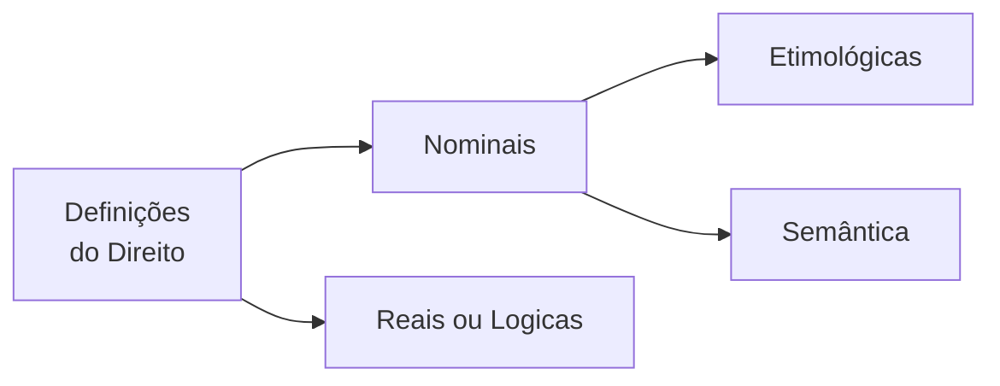

<table align="right" border="0">
  <tr>
    <td align="center" valign="top">
      <a href="https://github.com/dnlclaudino/gestao-do-conhecimento#readme">
         Início da  Gestão do  Conhecimento
      </a>
    </td>
    <td align="center" valign="top">
      <a href="./README.md">
         Sumário da Fonte
      </a>
    </td>
    <td align="center" valign="top">
      <a href="../README.md">
         Início deste  Repositório
      </a>
    </td>
    <td align="center" valign="top">
         Baixar em PDF
    </td>
  </tr>
</table>       

# Definições e Acepções da Palavra Direito

<b>SUMÁRIO</b>

<!-- TOC updateonsave:false-->

- [Considerações Prévias](#considerações-prévias)
- [Definições Nominais](#definições-nominais)
  - [Definição Etimológica](#definição-etimológica)
  - [Definição Semântica](#definição-semântica)
- [Definições Reais ou Lógicas](#definições-reais-ou-lógicas)
- [Definições Históricas do Direito](#definições-históricas-do-direito)
- [Acepções da Palavra Direito](#acepções-da-palavra-direito)
  - [Considerações Prévias](#considerações-prévias-1)
  - [Ciência do Direito](#ciência-do-direito)
  - [Direito Natural e Direito Positivo](#direito-natural-e-direito-positivo)
  - [Direito Objetivo e Direito Subjetivo](#direito-objetivo-e-direito-subjetivo)
  - [O Emprego do Vocábulo no Sentido de Justiça](#o-emprego-do-vocábulo-no-sentido-de-justiça)
- [Conceito de Ordem Jurídica](#conceito-de-ordem-jurídica)

<!-- /TOC -->

## Considerações Prévias

- Emmanuel Kant, no século XVIII, dada a ampla divergência entre os juristas da época: "Os Juristas ainda estão a procura de uma definição para o Direito".
- Segundo Nader (2016, p.73), esta crítica, sob certo aspecto, ainda se mantém atual haja vista que não se formulou ainda uma definição que contemple todos os sentidos do vocábulo.
  - Existem DOIS MOTIVOS que trazem dificuldades para uma definição que contemple todos os sentidos do vocábulo:
    - Um motivo de NATUREZA METODOLÓGICA
      - Este motivo refere-se à prática de se examinar diretamente o **TEMA DA DEFINIÇÃO**;
    - Um motivo de relacionado com TENDÊNCIAS FILOSÓFICAS perante o Direito
- As DEFINIÇÕES sofrem influência das **inclinações do jurista**;
  - Se de inclinação LEGALISTA:
    - Identificará o Direito com a **NORMA JURÍDICA**;
  - Se de inclinação IDEALISTA:
    - Colocará a Justiça como elemento primordial;
  - Se de inclinação SOCIOLÓGICA:
    - Enfatizará o **ELEMENTO SOCIAL**;
  - Se de inclinação HISTORICISTA:
    - Enfatizam a questão evolutiva do Direito 
- Existem também definições curiosas conduzidas por formas especiais de experiência:
  - Para **PITÁGORAS**, sob a ótica da **Matemática**:
    - "O Direito é igual ao múltiplo de si mesmo"
- Em LÓGICA:
  - O vocáculo Direito é classificado como **termo análogo** ou **termo analógico**:
    - Pelo fato de **possuir vários significados**; e
    - Pelo fato de que, apesar desses significados se diferenciarem, **guardam entre si alguns nexos**. 
- **AO EMPREGARMOS O TERMO DIREITO**:
  - ORA o empregamos em **SENTIDO OBJETIVO**:
    - Como **NORMA DE ORGANIZAÇÃO SOCIAL**;
  - ORA o empregamos em **SENTIDO SUBJETIVO**
    - Para indicar **O PODER DE AGIR** que a lei garante;
  - ORA o empregamos como referência à **CIÊNCIA DO DIREITO**
  - Dentre outras possibilidades;
    - Como equivalente à **JUSTIÇA**;
    - Como equivalente ao **DIREITO POSITIVO**;
    - Como equivalente ao **DIREITO NATURAL**.
- A partir do que foi exposto nessa seção, INDAGA-SE:
  - Uma **ÚNICA DEFINIÇÃO** seria capaz de revelar as **diversas acepções** da palavra **DIREITO**, de acordo com **OS PRESSUPOSTOS DA LÓGICA** ?
- CONCLUI-SE QUE:
  - Por analogia, um fotógrafo teria a mesma dificuldade de registrar numa única foto as faces de um POLIEDRO;
  - **SERIA UM ERRO** enunciar-se <u>**apenas UMA DEFINIÇÃO DO DIREITO**</u>;
  - **DEVEM-SE** dar **TANTAS DEFINIÇÕES QUANTOS OS SENTIDOS DO VOCÁBULO**;

## Definições Nominais

- **ANTES** de elaborarmos uma **DEFINIÇÃO DO DIREITO**, devemos alcançar o seu **CONCEITO**;
  - Entenda-se como **CONCEITO DE DIREITO**  a sua 1º representação intelectual;
  - A familiaridade com o CONCEITO DE DIREITO permitirá a sua DEFINIÇÃO;
- DEFINIÇÃO:
  - É a **ARTE** de **EXTERIORIZAÇÃO DE UM CONCEITO**;
  - Que segue um **MÉTODO DE EXPOSIÇÃO**;
  - É uma **ATIVIDADE DE FINALIZAÇÃO** quando o sujeito (cognoscente) já conhece o OBJETO (cognoscido)
- Para **NADER (2016, p. XX)**, o **CONCEITO DE DIREITO** **não é captado** pelo estudioso <u>**nas primeiras reflexões**</u>.
  - A **formação** de um **CONCEITO DE DIREITO** passa por um **processo evolutivo**;
    - <u>**Partindo**</u> do **CONHECIMENTO VULGAR**;
    - <u>**Buscando alcançar**</u> o seu **CONHECIMENTO CIENTÍFICO** e, até, o CONHECIMENTO FILOSÓFICO, na medida em que **ADQUIRE NOVAS EXPERIÊNCIAS**;
- A **IMPORTÂNCIA** do **CONCEITO DE DIREITO**:
  - É importante para a teoria;
  - É importante para atividades práticas que envolvem
    - Interpretação do Direito em casos concretos;
    - Aplicação do Direito em casos concretos;
  - O **conceito** é um valioso **INSTRUMENTO DO RACIOCÍNIO JURÍDICO**;
    - É interessante notar que:
      - Em **outras áreas do saber**, o **conceito da ciência** **NÃO É essencial** às práticas correspondentes;
      - Para o Direito, o **conceito da ciência** **É essencial e fundamental** para as suas práticas correspondentes;
  - Quando o jurista articula um PROCESSO ARGUMENTATIVO diante de certas questões:
    - Ele recorre a PARADIGMAS
      - Um dos paradigmas é o CONCEITO DE DIREITO;
    - Ele deve buscar seu próprio conceito de Direito (_JUS_) como grande referencial que lhe proporcionará o encamihamento para as soluções a apresentar;
- As DEFINIÇÕES PARA O DIREITO podem ser:
  - **NOMINAIS**
    - Podem ser
      - Etimológicas; ou
      - Semânticas
    - Que procuram expressar o significado da palavra em função do nome do objeto;
  - **REAIS OU LÓGICAS**
    - Que fixam a **essencia do objeto**, fornecendo as suas notas básicas;
- Neste capítulo, Nader (2016, p.75) aborda quatro (04) definições para o Direito.

<b>Figura:</b> Definições do Direito 

<b>Fonte: Nader (2016, p. 75)</b>

### Definição Etimológica

- Esta espécie explica a origem do vocábulo, a sua genealogia.
A palavra Direito é oriunda do adjetivo latino directus, a, um (qualidade do que está conforme a reta; o que não tem inclinação, desvio ou curvatura), que provém do particípio passado do verbo dirigo, is, rexi,
rectum, dirigere, equivalente a guiar, conduzir, traçar, alinhar.
- O vocábulo surgiu na Idade Média, aproximadamente no século IV, e não foi empregado pelos romanos, que se utilizaram de jus, para designar o que era lícito e de injuria, para expressar o ilícito.
- A etimologia de jus é discutida pelos filólogos. 
  - Para uma corrente, provém do latim Jussum (mandado), particípio passado do verbo jubere, que corresponde, em nossa língua, a mandar, ordenar. O radical seria do sânscrito Yu (vínculo). 
  - Para outra corrente, o vocábulo estaria ligado a Justum (o que é justo), que teria o seu radical no védico Yós, que significa bom, santidade, proteção. Do vocábulo jus surgiram outros termos, que se incorporaram à terminologia jurídica: justiça, juiz, juízo, jurisconsulto, jurista, jurisprudência, jurisdição. 
- A preferência dos povos em geral pelo emprego do vocábulo Direito decorre, provavelmente, do fato de possuir significado mais amplo do que jus.

### Definição Semântica

- Semântica é a parte da gramática que registra os diferentes sentidos que a palavra alcança em seu desenvolvimento. O mundo das palavras possui vida e é dinâmico. O povo cria a linguagem e é agente de sua evolução. 
- A palavra Direito também possui história. 
  - Desde a sua formação, até o presente, passou por significados vários. 
  - Expressou, primeiramente, a qualidade do que está conforme a reta; e
  - Sucessivamente, designou: Aquilo que está conforme a lei; a própria lei; conjunto de leis; a ciência que estuda as leis.
- A definição nominal, a par de algumas contribuições que oferece, não pode ser indicada como fator decisivo à formação do conhecimento científico. 
  - O excessivo recurso à lexicografia, Herman Kantorowicz denomina de “**REALISMO VERBAL**” e o condena: “uma definição científica não pode ser estruturada através da lexicografia, ainda quando uma grande parte dos juristas de todos os tempos haja acreditado na possibilidade da utilização desse método.
  - Constitui, pois, erro fundamental, que tem viciado numerosas investigações em todos os campos do conhecimento, o fato de estimar as definições como algo relacionado com a questão do uso verdadeiro ou errôneo da linguagem.”

## Definições Reais ou Lógicas

## Definições Históricas do Direito

## Acepções da Palavra Direito

### Considerações Prévias

### Ciência do Direito

### Direito Natural e Direito Positivo

### Direito Objetivo e Direito Subjetivo

### O Emprego do Vocábulo no Sentido de Justiça

## Conceito de Ordem Jurídica

