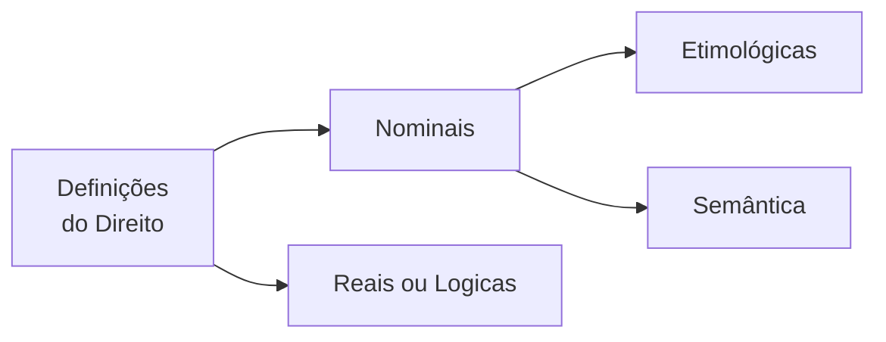

<table align="right" border="0">
  <tr>
    <td align="center" valign="top">
      <a href="https://github.com/dnlclaudino/gestao-do-conhecimento#readme">
         Início da  Gestão do  Conhecimento
      </a>
    </td>
    <td align="center" valign="top">
      <a href="./README.md">
         Sumário da Fonte
      </a>
    </td>
    <td align="center" valign="top">
      <a href="../README.md">
         Início deste  Repositório
      </a>
    </td>
    <td align="center" valign="top">
         Baixar em PDF
    </td>
  </tr>
</table>       

# Definições e Acepções da Palavra Direito

<b>SUMÁRIO</b>

<!-- TOC updateonsave:false -->

- [Definições e Acepções da Palavra Direito](#definições-e-acepções-da-palavra-direito)
  - [Considerações Prévias](#considerações-prévias)
  - [Definições Nominais](#definições-nominais)
    - [Definição Etimológica](#definição-etimológica)
      - [A palavra DIREITO](#a-palavra-direito)
      - [A palavra JUS](#a-palavra-jus)
    - [Definição Semântica](#definição-semântica)
  - [Definições Reais ou Lógicas](#definições-reais-ou-lógicas)
    - [Conjunto de normas de conduta social](#conjunto-de-normas-de-conduta-social)
    - [Imposto coercitivamente pelo Estado](#imposto-coercitivamente-pelo-estado)
    - [Para a realização da segurança segundo os critérios de justiça](#para-a-realização-da-segurança-segundo-os-critérios-de-justiça)
    - [Conclusão sobre as definições reais ou lógicas](#conclusão-sobre-as-definições-reais-ou-lógicas)
  - [Definições Históricas do Direito](#definições-históricas-do-direito)
  - [Acepções da Palavra Direito](#acepções-da-palavra-direito)
    - [Considerações Prévias](#considerações-prévias-1)
    - [Ciência do Direito](#ciência-do-direito)
    - [Direito Natural e Direito Positivo](#direito-natural-e-direito-positivo)
    - [Direito Objetivo e Direito Subjetivo](#direito-objetivo-e-direito-subjetivo)
    - [O Emprego do Vocábulo no Sentido de Justiça](#o-emprego-do-vocábulo-no-sentido-de-justiça)
  - [Conceito de Ordem Jurídica](#conceito-de-ordem-jurídica)

<!-- /TOC -->
<!-- /TOC -->

## Considerações Prévias

- Emmanuel Kant, no século XVIII, dada a ampla divergência entre os juristas da época: "Os Juristas ainda estão a procura de uma definição para o Direito".
- Segundo Nader (2016, p.73), esta crítica, sob certo aspecto, ainda se mantém atual haja vista que não se formulou ainda uma definição que contemple todos os sentidos do vocábulo.
  - Existem DOIS MOTIVOS que trazem dificuldades para uma definição que contemple todos os sentidos do vocábulo:
    - Um motivo de NATUREZA METODOLÓGICA
      - Este motivo refere-se à prática de se examinar diretamente o **TEMA DA DEFINIÇÃO**;
    - Um motivo de relacionado com TENDÊNCIAS FILOSÓFICAS perante o Direito
- As DEFINIÇÕES sofrem influência das **inclinações do jurista**;
  - Se de inclinação LEGALISTA:
    - Identificará o Direito com a **NORMA JURÍDICA**;
  - Se de inclinação IDEALISTA:
    - Colocará a Justiça como elemento primordial;
  - Se de inclinação SOCIOLÓGICA:
    - Enfatizará o **ELEMENTO SOCIAL**;
  - Se de inclinação HISTORICISTA:
    - Enfatizam a questão evolutiva do Direito 
- Existem também definições curiosas conduzidas por formas especiais de experiência:
  - Para **PITÁGORAS**, sob a ótica da **Matemática**:
    - "O Direito é igual ao múltiplo de si mesmo"
- Em LÓGICA:
  - O vocáculo Direito é classificado como **termo análogo** ou **termo analógico**:
    - Pelo fato de **possuir vários significados**; e
    - Pelo fato de que, apesar desses significados se diferenciarem, **guardam entre si alguns nexos**. 
- **AO EMPREGARMOS O TERMO DIREITO**:
  - ORA o empregamos em **SENTIDO OBJETIVO**:
    - Como **NORMA DE ORGANIZAÇÃO SOCIAL**;
  - ORA o empregamos em **SENTIDO SUBJETIVO**
    - Para indicar **O PODER DE AGIR** que a lei garante;
  - ORA o empregamos como referência à **CIÊNCIA DO DIREITO**
  - Dentre outras possibilidades;
    - Como equivalente à **JUSTIÇA**;
    - Como equivalente ao **DIREITO POSITIVO**;
    - Como equivalente ao **DIREITO NATURAL**.
- A partir do que foi exposto nessa seção, INDAGA-SE:
  - Uma **ÚNICA DEFINIÇÃO** seria capaz de revelar as **diversas acepções** da palavra **DIREITO**, de acordo com **OS PRESSUPOSTOS DA LÓGICA** ?
- CONCLUI-SE QUE:
  - Por analogia, um fotógrafo teria a mesma dificuldade de registrar numa única foto as faces de um POLIEDRO;
  - **SERIA UM ERRO** enunciar-se <u>**apenas UMA DEFINIÇÃO DO DIREITO**</u>;
  - **DEVEM-SE** dar **TANTAS DEFINIÇÕES QUANTOS OS SENTIDOS DO VOCÁBULO**;

## Definições Nominais

- **ANTES** de elaborarmos uma **DEFINIÇÃO DO DIREITO**, devemos alcançar o seu **CONCEITO**;
  - Entenda-se como **CONCEITO DE DIREITO**  a sua 1º representação intelectual;
  - A familiaridade com o CONCEITO DE DIREITO permitirá a sua DEFINIÇÃO;
- DEFINIÇÃO:
  - É a **ARTE** de **EXTERIORIZAÇÃO DE UM CONCEITO**;
  - Que segue um **MÉTODO DE EXPOSIÇÃO**;
  - É uma **ATIVIDADE DE FINALIZAÇÃO** quando o sujeito (cognoscente) já conhece o OBJETO (cognoscido)
- Para **NADER (2016, p. XX)**, o **CONCEITO DE DIREITO** **não é captado** pelo estudioso <u>**nas primeiras reflexões**</u>.
  - A **formação** de um **CONCEITO DE DIREITO** passa por um **processo evolutivo**;
    - <u>**Partindo**</u> do **CONHECIMENTO VULGAR**;
    - <u>**Buscando alcançar**</u> o seu **CONHECIMENTO CIENTÍFICO** e, até, o CONHECIMENTO FILOSÓFICO, na medida em que **ADQUIRE NOVAS EXPERIÊNCIAS**;
- A **IMPORTÂNCIA** do **CONCEITO DE DIREITO**:
  - É importante para a teoria;
  - É importante para atividades práticas que envolvem
    - Interpretação do Direito em casos concretos;
    - Aplicação do Direito em casos concretos;
  - O **conceito** é um valioso **INSTRUMENTO DO RACIOCÍNIO JURÍDICO**;
    - É interessante notar que:
      - Em **outras áreas do saber**, o **conceito da ciência** **NÃO É essencial** às práticas correspondentes;
      - Para o Direito, o **conceito da ciência** **É essencial e fundamental** para as suas práticas correspondentes;
  - Quando o jurista articula um PROCESSO ARGUMENTATIVO diante de certas questões:
    - Ele recorre a PARADIGMAS
      - Um dos paradigmas é o CONCEITO DE DIREITO;
    - Ele deve buscar seu próprio conceito de Direito (_JUS_) como grande referencial que lhe proporcionará o encamihamento para as soluções a apresentar;
- As DEFINIÇÕES PARA O DIREITO podem ser:
  - **NOMINAIS**
    - Podem ser
      - Etimológicas; ou
      - Semânticas
    - Que procuram expressar o significado da palavra em função do nome do objeto;
  - **REAIS OU LÓGICAS**
    - Que fixam a **essencia do objeto**, fornecendo as suas notas básicas;
- Neste capítulo, Nader (2016, p.75) aborda quatro (04) definições para o Direito.

<b>Figura:</b> Definições do Direito 

<b>Fonte: Nader (2016, p. 75)</b>

### Definição Etimológica

- A definição etimológica explica a origem do vocábulo, a sua genealogia.

#### A palavra DIREITO

- A palavra Direito
  - É oriunda do adjetivo latino **_directus_**, a, um
    - Qualidade do que está conforme a reta;
    - Que não tem inclinação, desvio ou curvatura;
    - Provém do particípio passado do verbo **_dirigo_**, is, rexi,
**_rectum_**, **_dirigere_**, equivalente a:
      - Guiar, conduzir, traçar, alinhar.
- O vocábulo Direito:
  - Surgiu aproximadamente no séc. IV, na Idade Média;
  - Não foi empregado pelos romanos
    - Que se utilizaram de **_jus_**, para designar o que era lícito; e
    - Que se utilizaram de **_injuria_**, para expressar o ilícito.

#### A palavra JUS

- A **ETIMOLOGIA DE JUS** é discutida pelos filólogos:
  - **PARA UMA CORRENTE**:
    - Provém do latim **_Jussum_** (mandado)
      - Particípio passado do verbo **_jubere_**, que corresponde, em nossa língua:
        - A mandar, ordenar.
      -  O radical seria do sânscrito **_Yu_** (vínculo). 
  - **PARA OUTRA CORRENTE**:
    - O vocábulo estaria ligado a **_Justum_** (o que é justo)
      - Que teria o seu radical no védico **_Yós_**, que significa:
        - Bom, santidade, proteção.
- Do **VOCÁBULO JUS** surgiram outros termos, que se incorporaram à terminologia jurídica:
  - justiça, juiz, juízo, jurisconsulto, jurista, jurisprudência, jurisdição. 
- A <u>**preferência dos povos em geral**</u> pelo emprego do **vocábulo Direito** decorre, provavelmente, do <u>**fato de possuir significado mais amplo do que jus**</u>.

### Definição Semântica

- Semântica é a parte da gramática que **registra os diferentes sentidos** que a palavra alcança em seu desenvolvimento.
- O mundo das palavras possui vida e é dinâmico;
- O povo cria a linguagem e é agente de sua evolução;
- A **PALAVRA DIREITO** também possui história. 
  - Desde a sua formação, até o presente, passou por significados vários; 
  - 1️⃣ Expressou, <u>**primeiramente**</u>:
    - A qualidade do que está conforme a reta; e
  - 2️⃣ <u>**Sucessivamente**</u>, designou:
    - Aquilo que está conforme a lei;
    - A própria lei;
    - Conjunto de leis;
    - A ciência que estuda as leis.
- A **definição nominal**, a par de algumas contribuições que oferece:
  - **Não pode ser indicada** como fator decisivo à formação do conhecimento científico; 
  - **O excessivo recurso à lexicografia**, Herman Kantorowicz denomina de “**REALISMO VERBAL**” e o condena: “uma definição científica não pode ser estruturada através da lexicografia, ainda quando uma grande parte dos juristas de todos os tempos haja acreditado na possibilidade da utilização desse método.
  - **Constitui, pois, erro fundamental** , que tem viciado numerosas investigações em todos os campos do conhecimento, o fato de 
    - **Estimar as definições** como algo relacionado com a questão do **uso verdadeiro** ou **uso errôneo** <u>da **linguagem**</u>.”

## Definições Reais ou Lógicas

- Definir:
  - **IMPLICA**:
    - Delimitar;
    - Assinalar as notas mais gerais; e
    - Assinalar as específicas do objeto
  - **COM A FINALIDADE DE**:
    - Distingui-lo de qualquer outro
- A **TAREFA DE DEFINIR**
  - Corresponde a uma necessidade de ordem e de firmeza dos conhecimentos (indispensável à organização das ciências);
- Os romanos afirmaram:
  - **_Omne definitio periculosa est_** (toda definição é perigosa); assim como
  - **_Definitio est initium omni disputationi_** (a definição é o princípio para toda disputa).
- A **TÉCNICA DAS DEFINIÇÕES REAIS** exige a escolha de um **MÉTODO ADEQUADO**;
- Para se atender aos **PRESSUPOSTOS DA LÓGICA FORMAL**:
    - A definição <u>deverá apontar</u>:
      - O **GÊNERO PRÓXIMO**; e
      - A **DIFERENÇA ESPECÍFICA**.
- Este critério era conhecido e adotado pelos antigos romanos, que já afirmavam:
  - **_Definitio fit per genus proximum et differentiam specificam_** (A definição se torna um gênero próximo e uma diferença específica).
  - O **GÊNERO PRÓXIMO** de uma definição **apresenta as notas comuns** às diversas espécies que compõem um gênero;
  - A **DIFERENÇA ESPECÍFICA** **fornece o traço peculiar, exclusivo, que vai distinguir o objeto** definido das demais espécies;
- Em **relação ao Direito**:
  - O **gênero próximo** da definição é constituído pelo núcleo comum aos diferentes instrumentos de controle social: Direito, Moral, Regras de Trato Social e Religião.
  - A **diferença específica** deve apontar a característica que somente o Direito possui e o separa dos demais processos de conduta social
- Examinando o **vocábulo Direito** do ponto de vista **objetivo**:
  - **Direito** é um conjunto de normas de conduta social, imposto coercitivamente pelo Estado, para a realização da segurança, segundo os critérios de justiça.
  - **Nos subitens abaixo**, dividiremos essa definição do Direito em partes e detalharemos o que as partes significam.

### Conjunto de normas de conduta social

- **Conjunto de normas de conduta social**:
  - É o gênero próximo;
  - Nesta primeira parte da definição:
    - É comum aos demais instrumentos de controle social;
    - Estão presentes **DOIS** importantes **ELEMENTOS**:
      - Normas; e
        - As normas definem os procedimentos a serem adotados pelos destinatários do Direito;
        - As normas Fixam pautas de comportamento social;
        - As normas estabelecem os limites de liberdade para os homens em sociedade;
        - As proibições impostas pelas normas jurídicas traçam a linha divisória entre o **lícito** e o **ilícito**;
        - As normas impõem obrigações apenas do ponto de vista social
      - Conduta social.
        - A **conduta exigida** **não alcança** o homem na sua **intimidade**;
          - Este âmbito é reservado à **Moral** e à **Religião**.
    - É **fundamental para a vida do Direito**:
      - 1️⃣ Que **haja adesão** às **normas jurídicas** (aos comandos jurídicos);
      - 2️⃣ Que as **condutas sociais** <u>sigam</u> os ditames das **normas jurídicas**.
    - O Direito **sem efetividade** é <u>**letra morta**</u>; existirá apenas formalmente.
    - **Além de normas que disciplinam o convívio social**, o **ordenamento jurídico** reúne disposições:
      - Que organizam o Estado e se impõem a quem detém parcela de poder;
      - Cuida ainda das relações entre as pessoas e os órgãos públicos.
    
### Imposto coercitivamente pelo Estado

### Para a realização da segurança segundo os critérios de justiça

### Conclusão sobre as definições reais ou lógicas

- **Não há**, entre os **filósofos do Direito**:
  - **Uma definição padronizada sobre a JUSTIÇA**;
  - **A ideia matriz** de <u>**quase todas as concepções**</u> partiu de **Ulpiano**, jurisconsulto romano, que a empregou como virtude moral:
    - **_Iustitia est constans et perpetua voluntas ius suum quique tribuendi_** (a justiça é a constante e permanente vontade de dar a cada um o seu direito)

## Definições Históricas do Direito

## Acepções da Palavra Direito

### Considerações Prévias

### Ciência do Direito

### Direito Natural e Direito Positivo

### Direito Objetivo e Direito Subjetivo

### O Emprego do Vocábulo no Sentido de Justiça

## Conceito de Ordem Jurídica

