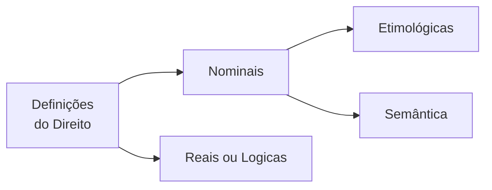

<table align="right" border="0">
  <tr>
    <td align="center" valign="top">
      <a href="https://github.com/dnlclaudino/gestao-do-conhecimento#readme">
         Início da  Gestão do  Conhecimento
      </a>
    </td>
    <td align="center" valign="top">
      <a href="./README.md">
         Sumário da Fonte
      </a>
    </td>
    <td align="center" valign="top">
      <a href="../README.md">
         Início deste  Repositório
      </a>
    </td>
    <td align="center" valign="top">
         Baixar em PDF
    </td>
  </tr>
</table>       

# Definições e Acepções da Palavra Direito

<b>SUMÁRIO</b>

<!-- TOC updateonsave:false -->

- [Definições e Acepções da Palavra Direito](#definições-e-acepções-da-palavra-direito)
  - [Considerações Prévias](#considerações-prévias)
  - [Definições Nominais](#definições-nominais)
    - [Definição Etimológica](#definição-etimológica)
      - [A palavra DIREITO](#a-palavra-direito)
      - [A palavra JUS](#a-palavra-jus)
    - [Definição Semântica](#definição-semântica)
  - [Definições Reais ou Lógicas](#definições-reais-ou-lógicas)
    - [Conjunto de normas de conduta social](#conjunto-de-normas-de-conduta-social)
    - [Imposto coercitivamente pelo Estado](#imposto-coercitivamente-pelo-estado)
    - [Para a realização da segurança segundo os critérios de justiça](#para-a-realização-da-segurança-segundo-os-critérios-de-justiça)
  - [Definições Históricas do Direito](#definições-históricas-do-direito)
  - [Acepções da Palavra Direito](#acepções-da-palavra-direito)
    - [Considerações Prévias](#considerações-prévias-1)
    - [Ciência do Direito](#ciência-do-direito)
    - [Direito Natural e Direito Positivo](#direito-natural-e-direito-positivo)
      - [Direito Natural](#direito-natural)
      - [Direito Positivo](#direito-positivo)
    - [Direito Objetivo e Direito Subjetivo](#direito-objetivo-e-direito-subjetivo)
    - [O Emprego do Vocábulo no Sentido de Justiça](#o-emprego-do-vocábulo-no-sentido-de-justiça)
  - [Conceito de Ordem Jurídica](#conceito-de-ordem-jurídica)

<!-- /TOC -->

## Considerações Prévias

- Emmanuel Kant, no século XVIII, dada a ampla divergência entre os juristas da época: "Os Juristas ainda estão a procura de uma definição para o Direito".
- Segundo Nader (2016, p.73), esta crítica, sob certo aspecto, ainda se mantém atual haja vista que não se formulou ainda uma definição que contemple todos os sentidos do vocábulo.
  - Existem DOIS MOTIVOS que trazem dificuldades para uma definição que contemple todos os sentidos do vocábulo:
    - Um motivo de NATUREZA METODOLÓGICA
      - Este motivo refere-se à prática de se examinar diretamente o **TEMA DA DEFINIÇÃO**;
    - Um motivo de relacionado com TENDÊNCIAS FILOSÓFICAS perante o Direito
- As DEFINIÇÕES sofrem influência das **inclinações do jurista**;
  - Se de inclinação LEGALISTA:
    - Identificará o Direito com a **NORMA JURÍDICA**;
  - Se de inclinação IDEALISTA:
    - Colocará a Justiça como elemento primordial;
  - Se de inclinação SOCIOLÓGICA:
    - Enfatizará o **ELEMENTO SOCIAL**;
  - Se de inclinação HISTORICISTA:
    - Enfatizam a questão evolutiva do Direito
- Existem também definições curiosas conduzidas por formas especiais de experiência:
  - Para **PITÁGORAS**, sob a ótica da **Matemática**:
    - "O Direito é igual ao múltiplo de si mesmo"
- Em LÓGICA:
  - O vocáculo Direito é classificado como **termo análogo** ou **termo analógico**:
    - Pelo fato de **possuir vários significados**; e
    - Pelo fato de que, apesar desses significados se diferenciarem, **guardam entre si alguns nexos**.
- **AO EMPREGARMOS O TERMO DIREITO**:
  - ORA o empregamos em **SENTIDO OBJETIVO**:
    - Como **NORMA DE ORGANIZAÇÃO SOCIAL**;
  - ORA o empregamos em **SENTIDO SUBJETIVO**
    - Para indicar **O PODER DE AGIR** que a lei garante;
  - ORA o empregamos como referência à **CIÊNCIA DO DIREITO**
  - Dentre outras possibilidades;
    - Como equivalente à **JUSTIÇA**;
    - Como equivalente ao **DIREITO POSITIVO**;
    - Como equivalente ao **DIREITO NATURAL**.
- A partir do que foi exposto nessa seção, INDAGA-SE:
  - Uma **ÚNICA DEFINIÇÃO** seria capaz de revelar as **diversas acepções** da palavra **DIREITO**, de acordo com **OS PRESSUPOSTOS DA LÓGICA** ?
- CONCLUI-SE QUE:
  - Por analogia, um fotógrafo teria a mesma dificuldade de registrar numa única foto as faces de um POLIEDRO;
  - **SERIA UM ERRO** enunciar-se <u>**apenas UMA DEFINIÇÃO DO DIREITO**</u>;
  - **DEVEM-SE** dar **TANTAS DEFINIÇÕES QUANTOS OS SENTIDOS DO VOCÁBULO**;

## Definições Nominais

- **ANTES** de elaborarmos uma **DEFINIÇÃO DO DIREITO**, devemos alcançar o seu **CONCEITO**;
  - Entenda-se como **CONCEITO DE DIREITO**  a sua 1º representação intelectual;
  - A familiaridade com o CONCEITO DE DIREITO permitirá a sua DEFINIÇÃO;
- DEFINIÇÃO:
  - É a **ARTE** de **EXTERIORIZAÇÃO DE UM CONCEITO**;
  - Que segue um **MÉTODO DE EXPOSIÇÃO**;
  - É uma **ATIVIDADE DE FINALIZAÇÃO** quando o sujeito (cognoscente) já conhece o OBJETO (cognoscido)
- Para **NADER (2016, p. XX)**, o **CONCEITO DE DIREITO** **não é captado** pelo estudioso <u>**nas primeiras reflexões**</u>.
  - A **formação** de um **CONCEITO DE DIREITO** passa por um **processo evolutivo**;
    - <u>**Partindo**</u> do **CONHECIMENTO VULGAR**;
    - <u>**Buscando alcançar**</u> o seu **CONHECIMENTO CIENTÍFICO** e, até, o CONHECIMENTO FILOSÓFICO, na medida em que **ADQUIRE NOVAS EXPERIÊNCIAS**;
- A **IMPORTÂNCIA** do **CONCEITO DE DIREITO**:
  - É importante para a teoria;
  - É importante para atividades práticas que envolvem
    - Interpretação do Direito em casos concretos;
    - Aplicação do Direito em casos concretos;
  - O **conceito** é um valioso **INSTRUMENTO DO RACIOCÍNIO JURÍDICO**;
    - É interessante notar que:
      - Em **outras áreas do saber**, o **conceito da ciência** **NÃO É essencial** às práticas correspondentes;
      - Para o Direito, o **conceito da ciência** **É essencial e fundamental** para as suas práticas correspondentes;
  - Quando o jurista articula um PROCESSO ARGUMENTATIVO diante de certas questões:
    - Ele recorre a PARADIGMAS
      - Um dos paradigmas é o CONCEITO DE DIREITO;
    - Ele deve buscar seu próprio conceito de Direito (_JUS_) como grande referencial que lhe proporcionará o encamihamento para as soluções a apresentar;
- As DEFINIÇÕES PARA O DIREITO podem ser:
  - **NOMINAIS**
    - Podem ser
      - Etimológicas; ou
      - Semânticas
    - Que procuram expressar o significado da palavra em função do nome do objeto;
  - **REAIS OU LÓGICAS**
    - Que fixam a **essencia do objeto**, fornecendo as suas notas básicas;
- Neste capítulo, Nader (2016, p.75) aborda quatro (04) definições para o Direito.

<b>Figura:</b> Definições do Direito 

<b>Fonte: Nader (2016, p. 75)</b>

### Definição Etimológica

- A definição etimológica explica a origem do vocábulo, a sua genealogia.

#### A palavra DIREITO

- A palavra Direito
  - É oriunda do adjetivo latino **_directus_**, a, um
    - Qualidade do que está conforme a reta;
    - Que não tem inclinação, desvio ou curvatura;
    - Provém do particípio passado do verbo **_dirigo_**, is, rexi,
**_rectum_**, **_dirigere_**, equivalente a:
      - Guiar, conduzir, traçar, alinhar.
- O vocábulo Direito:
  - Surgiu aproximadamente no séc. IV, na Idade Média;
  - Não foi empregado pelos romanos
    - Que se utilizaram de **_jus_**, para designar o que era lícito; e
    - Que se utilizaram de **_injuria_**, para expressar o ilícito.

#### A palavra JUS

- A **ETIMOLOGIA DE JUS** é discutida pelos filólogos:
  - **PARA UMA CORRENTE**:
    - Provém do latim **_Jussum_** (mandado)
      - Particípio passado do verbo **_jubere_**, que corresponde, em nossa língua:
        - A mandar, ordenar.
      - O radical seria do sânscrito **_Yu_** (vínculo).
  - **PARA OUTRA CORRENTE**:
    - O vocábulo estaria ligado a **_Justum_** (o que é justo)
      - Que teria o seu radical no védico **_Yós_**, que significa:
        - Bom, santidade, proteção.
- Do **VOCÁBULO JUS** surgiram outros termos, que se incorporaram à terminologia jurídica:
  - justiça, juiz, juízo, jurisconsulto, jurista, jurisprudência, jurisdição.
- A <u>**preferência dos povos em geral**</u> pelo emprego do **vocábulo Direito** decorre, provavelmente, do <u>**fato de possuir significado mais amplo do que jus**</u>.

### Definição Semântica

- Semântica é a parte da gramática que **registra os diferentes sentidos** que a palavra alcança em seu desenvolvimento.
- O mundo das palavras possui vida e é dinâmico;
- O povo cria a linguagem e é agente de sua evolução;
- A **PALAVRA DIREITO** também possui história.
  - Desde a sua formação, até o presente, passou por significados vários;
  - 1️⃣ Expressou, <u>**primeiramente**</u>:
    - A qualidade do que está conforme a reta; e
  - 2️⃣ <u>**Sucessivamente**</u>, designou:
    - Aquilo que está conforme a lei;
    - A própria lei;
    - Conjunto de leis;
    - A ciência que estuda as leis.
- A **definição nominal**, a par de algumas contribuições que oferece:
  - **Não pode ser indicada** como fator decisivo à formação do conhecimento científico;
  - **O excessivo recurso à lexicografia**, Herman Kantorowicz denomina de “**REALISMO VERBAL**” e o condena: “uma definição científica não pode ser estruturada através da lexicografia, ainda quando uma grande parte dos juristas de todos os tempos haja acreditado na possibilidade da utilização desse método.
  - **Constitui, pois, erro fundamental** , que tem viciado numerosas investigações em todos os campos do conhecimento, o fato de
    - **Estimar as definições** como algo relacionado com a questão do **uso verdadeiro** ou **uso errôneo** <u>da **linguagem**</u>.”

## Definições Reais ou Lógicas

- Definir:
  - **IMPLICA**:
    - Delimitar;
    - Assinalar as notas mais gerais; e
    - Assinalar as específicas do objeto
  - **COM A FINALIDADE DE**:
    - Distingui-lo de qualquer outro
- A **TAREFA DE DEFINIR**
  - Corresponde a uma necessidade de ordem e de firmeza dos conhecimentos (indispensável à organização das ciências);
- Os romanos afirmaram:
  - **_Omne definitio periculosa est_** (toda definição é perigosa); assim como
  - **_Definitio est initium omni disputationi_** (a definição é o princípio para toda disputa).
- A **TÉCNICA DAS DEFINIÇÕES REAIS** exige a escolha de um **MÉTODO ADEQUADO**;
- Para se atender aos **PRESSUPOSTOS DA LÓGICA FORMAL**:
  - A definição <u>deverá apontar</u>:
    - O **GÊNERO PRÓXIMO**; e
    - A **DIFERENÇA ESPECÍFICA**.
- Este critério era conhecido e adotado pelos antigos romanos, que já afirmavam:
  - **_Definitio fit per genus proximum et differentiam specificam_** (A definição se torna um gênero próximo e uma diferença específica).
  - O **GÊNERO PRÓXIMO** de uma definição **apresenta as notas comuns** às diversas espécies que compõem um gênero;
  - A **DIFERENÇA ESPECÍFICA** **fornece o traço peculiar, exclusivo, que vai distinguir o objeto** definido das demais espécies;
- Em **relação ao Direito**:
  - O **gênero próximo** da definição é constituído pelo núcleo comum aos diferentes instrumentos de controle social: Direito, Moral, Regras de Trato Social e Religião.
  - A **diferença específica** deve apontar a característica que somente o Direito possui e o separa dos demais processos de conduta social
- Examinando o **vocábulo Direito** do ponto de vista **objetivo**.

<table border="1" id="quadro-definicao-o-que-e-o-direito">
  <tr>
    <td align="center" width="140px" style="border-right-style:hidden">
       
      <b>Definição</b>
    </td>
    <td valign="top">
     
<b>O QUE É O DIREITO ?🤔</b>

     
Para Nader (2016, p.XX)</b>, <b>O DIREITO</b> é um conjunto de normas de conduta social, imposto coercitivamente pelo Estado, para a realização da segurança, segundo os critérios de justiça.

    </td>
  </tr>
</table>

- **Nos subitens abaixo**, dividiremos essa definição do Direito em partes e detalharemos o que as partes significam.

### Conjunto de normas de conduta social

- **Conjunto de NORMAS DE CONDUTA SOCIAL**:
  - É o gênero próximo;
  - Nesta primeira parte da definição:
    - É comum aos demais instrumentos de controle social;
    - Estão presentes **DOIS** importantes **ELEMENTOS**:
      - 1️⃣ **NORMAS**; e
        - As normas **definem os procedimentos** a serem adotados pelos destinatários do Direito;
        - As normas **fixam pautas de comportamento** social;
        - As normas **estabelecem os limites de liberdade** para os homens em sociedade;
        - As proibições impostas pelas normas jurídicas **traçam a linha divisória** entre o **lícito** e o **ilícito**;
        - As normas impõem obrigações apenas do ponto de vista social
      - 2️⃣ **CONDUTA SOCIAL**.
        - A **conduta exigida** **não alcança** o homem na sua **intimidade**;
          - Este âmbito é reservado à **Moral** e à **Religião**.
    - **DUAS COISAS** são **fundamentais para a vida do Direito**:
      - 1️⃣ Que **haja adesão** às **normas jurídicas** (aos comandos jurídicos);
      - 2️⃣ Que as **condutas sociais** <u>sigam</u> os ditames das **normas jurídicas**.
    - O Direito **sem efetividade** é <u>**letra morta**</u>; existirá apenas formalmente.
    - **ALÉM DE NORMAS QUE DISCIPLINAM O CONVÍVIO SOCIAL**, o **ordenamento jurídico** reúne disposições:
      - Que **organizam o Estado** e **se impõem a quem detém parcela de poder**;
      - Cuida ainda das **relações entre as pessoas e os órgãos públicos**.

### Imposto coercitivamente pelo Estado

- Essa é a diferença específica;
- **Apenas as NORMAS JURÍDICAS** **requerem a participação do Estado**, **AO CONTRÁRIO** das outras espécies de normas;
- O **ESTADO** controla a vida jurídica do país;
  - É indispensável que esteja devidamente estruturado de acordo com a clássica divisão dos poderes:
    - Legislativo;
    - Executivo; e
    - Judiciário
  - É indispensável que esses poderes cumpram as funções que lhes são próprias;
- O **comando que o Estado exerce** **não significa**, <u>obrigatoriamente</u>, o **MONOPÓLIO DAS FONTES CRIADORAS DO DIREITO**;
- Ao Estado **COMPETE**
  - Estabelecer o **<u>ELENCO</u>** DAS <u>**FONTES FORMAIS</u> DO DIREITO**;
  - Estabelecer a **<u>HIERARQUIA</u>** DAS <u>**FONTES FORMAIS**</u> DO DIREITO.
- Na dependência dos **CRITÉRIOS** adotados pelo **SISTEMA JURÍDICO DO ESTADO**:
  - Os **COSTUMES** **podem figurar**, ao lado da **LEI**, uma **FONTE DO DIREITO** (elemento fontal do Direito)
  - Os **DECISÕES UNIFORMES DOS TRIBUNAIS (JURISPRUDÊNCIA)** **podem figurar**, ao lado da **LEI**, uma **FONTE DO DIREITO** (elemento fontal do Direito).
  - Assim ocorrendo, a sociedade e os tribunais, diretamente, **poderão introduzir**, no mundo jurídico, **NOVAS NORMAS DE CONDUTA
SOCIAL**.
- As **REGRAS DE COMPORTAMENTO**
  - **NÃO existem** apenas como **enunciados** submetidos à vontade de seus destinatários;
  - Os **deveres jurídicos** se revelam em uma ambiência, onde a **liberdade** e a **força coexistem**;
  - Como **ser racional** e **responsável**, o homem **deve ajustar** a sua **conduta**, com vontade própria, **aos preceitos legais**.
  - **Esta atitude de espontânea adesão, contudo, não é prática comum a todos os homens**.
  - Surge, daí, a imperiosa **necessidade** de **o Direito ser dotado** de um **MECANISMO DE COERÇÃO**, em que **O ELEMENTO FORÇA** se apresente **EM ESTADO LATENTE**, mas apto a ser acionado nas circunstâncias próprias.
  - A **COERCITIVIDADE**, a cargo do Estado, **é uma reserva de força** que **exerce intimidação** sobre os destinatários das normas jurídicas.

### Para a realização da segurança segundo os critérios de justiça

- O **APARATO LEGAL**
  - **DEVE SER** considerando como:
    - MEIO;
    - INTRUMENTO;
    - RECURSO.
  - Existe em função do **BEM-ESTAR** da sociedade
- A **JUSTIÇA** ⚖️
  - É a **causa final** do Direito;
  - É a **razão de ser** do Direito;
- A **fórmula para alcançar a justiça** **JURIDICAMENTE** é através de **NORMAS**;

<table border="1" id="quadro-atencao-direito-justica-seguranca-juridica">
  <tr>
    <td align="center" valign="top"width="140px" style="border-right-style:hidden">
       
      <b>Atenção</b>
    </td>
    <td valign="top">
     

       Para <b>REALIZAR PLENAMENTE A JUSTIÇA</b> ⚖️ PRESSUPÕE-SE A <b>SEGURANÇA JURÍDICA</b>
     

      <ul>
        <li>Para <b>SEGURANÇA JURIDICA</b>  ser alcançada <b>DEPENDE-SE DE</b>:</li>
        <ul>
          <li>Organização;</li>
          <li>Ordem jurídica bem definida;</li>
          <li>Garantia de respeito ao patrimônio jurídico do cidadão</li>
        </ul>
     </ul>
     

       É preciso cultivar o <b>VALOR DA SEGURANÇA JURÍDICA</b> para se alcançar a <b>JUSTIÇA.</b>
     

     

       A <b>JUSTIÇA</b> é a <b>META</b> o <b>ALVO</b>, o <b>OBJETIVO MAIOR</b> do Direito.
     

    </td>
  </tr>
</table>

<!-- Para visualizar os ícones disponíveis, visite: https://github.com/dnlclaudino/imagens#readme -->
<table border="1" id="quadro-definicao-XXXXX">
<tr>
  <td align="center" valign="top"width="140px" style="border-right-style:hidden">
    
   <b>Lembre-se</b>
  </td>
  <td valign="top">

<b>A IDEIA DE <u>JUSTICA</u></b>

  

    Entre os filósofos do Direito, <b>NÃO HÁ</b> uma <b>DEFINIÇÃO <u>PADRONIZADA</u></b> sobre a <b><u>JUSTIÇA</u></b>.
  

  

    A <b>IDEIA MATRIZ DE JUSTIÇA</b> partiu da definição do jurisconsulto <b>ULPIANO</b>:
  

   <ul>
     <li>A JUSTIÇA é uma  <b><u>VIRTUDE MORAL</u></b>;</li>
      <li>"A JUSTIÇA é a <b>constante</b> e <b>permanente</b> <b><u>vontade</u></b> de <b>dar a cada um o seu direito</b>.</li>
   </ul>
   </td>
</tr>
</table>

<table border="1" id="quadro-citacao-jurisconsulto-romano-ulpiano-conceito-justica">
  <tr>
    <td align="center" width="140px" style="border-right-style:hidden">
       
      <b>Jurisconsulto romano: Ulpiano (150-223)</b>
    </td>
    <td valign="top">
      
<b><i>Iutitia est constans perpetua voluntas ius suum quique tribuendi</i></b>.

      
A <b>JUSTIÇA</b> é a <b>constante</b> e <b>permanente</b> <b><u>vontade</u></b> de <b>dar a cada um o seu direito</b>.

    </td>
  </tr>
</table>

<table border="1" id="quadro-citacao-jurisconsulto-romano-ulpiano-conceito-direito">
  <tr>
    <td align="center" width="140px" style="border-right-style:hidden">
       
      <b>Para Saber Mais</b>
    </td>
    <td valign="top">
    
<b>OUTRA CITAÇÃO ATRIBUÍDA A ULPIANO SOBRE O <u>DIREITO</u></b>

  

      
<b><i>(...) Juris Praecepta Sunt haec: Honeste Vivere, Alterum Non Laedere, Suum Cuique Tribuere”.</i></b>

      
 (...) tais são os preceitos do direito: <b>viver honestamente</b>, <b>não ofender ninguém</b>, <b>dar a cada um o que lhe pertence</b>.

    </td>
  </tr>
</table>

## Definições Históricas do Direito

- As **definições históricas do Direito** também são referenciadas como "**definições clássicas do Direito**";
- As definições são <u>úteis</u> e <u>importantes</u> na medida em que nos permitem uma **análise crítica** que enriquecerá a nossa **definição de Direito**;

<table border="1" id="quadro-grande-pensador-celso">
<tr>
  <td align="center" valign="top"width="140px" style="border-right-style:hidden">
    
   <b>Grande Pensador</b>
  </td>
  <td valign="top">

<b>DEFINIÇÃO CLÁSSICAS DO DIREITO CELSO: O jurisconsulto romano do século I d.C.</b>

  

    O <b>DIREITO</b> é a <u>arte</u> <b>do bom</b> e <b>do justo</b>.
  

  

    <b>Análise crítica</b> apresentada por <b>Nader (2016, p. 78)</b>:
  

   <ul>
     <li>Essa definição possui forte influência da <b>Filosofia</b> e da <b>Ética</b>;</li>
     <li>Essa definição coloca em evidência apenas a <b>finalidade do Direito</b>, tornando-a <b>insuficiente</b>;</li>
   </ul>
   </td>
</tr>
</table>

<table border="1" id="quadro-grande-pensador-dante-alighieri">
<tr>
  <td align="center" valign="top"width="140px" style="border-right-style:hidden">
    
   <b>Grande Pensador</b>
  </td>
  <td valign="top">

<b>DEFINIÇÃO CLÁSSICAS DO DIREITO DANTE ALIGHIERI: O escritor italiano do século XIII d.C.</b>

   
Em sua obra "<i>De monarchia</i>", o escritor iteliano expos suas ideias político-jurídicas expressando a seguinte definição clássica do Direito:

  

    O <b>DIREITO</b> é a <u>proporção</u> <b>real</b> e <b>pessoal</b> de homem para homem que, conservada, conserva a sociedade e que, destruída, a destrói.
  

  

    <b>Análise crítica</b>: <b>Nader (2016, p. 78)</b> afirma que as qualidades da definição apresentada por Dante Alighieri tornam críticas a sua definição secundários. Acrescento, contudo, com base nas <b>características de uma definição</b> apresentadas na seção "Definições Reais ou Lógicas" (NADER, 2016, p. 76) que:
  

   <ul>
     <li>Essa definição faz dintinçao entre <b>direitos reais</b> e <b>direitos pessoais;</b></li>
     <li>Essa definição tras a características da <b>alteridade</b>, qualidade do Direito de <b>vincular pessoas e <u>apenas pessoas</u></b>;</li>
     <li>Essa definição carece de <b>características específicas</b> que distinguam o Direito de outras formas de "proporção" que preserva ou destrói a sociedade, respectivamente, em sua presença ou ausência.;</li>
     <li>Entendo, com todo o respeito a admiração de Paulo Nader ao autor italiano, que sua definição é por demais abstrata, apesar de refletir que proporcionalidade é característica essencial da justiça sem a qual o Direito não pode atingir sua finalidade;</li>
   </ul>
   </td>
</tr>
</table>

<table border="1" id="quadro-grande-pensador-hugo-grocio">
<tr>
  <td align="center" valign="top"width="140px" style="border-right-style:hidden">
    
   <b>Grande Pensador</b>
  </td>
  <td valign="top">

<b>DEFINIÇÃO CLÁSSICAS DO DIREITO HUGO GRÓCIO: O jurisconsulto holandês do século XVI d.C.</b>

  

    O <b>DIREITO</b> é o <u>conjunto</u> de <b>normas ditadas pela <u>razÃo</u></b> e sugeridas pelo <b><i>appetitus societatis</i></b>.
  

  

    <b>Análise crítica</b> apresentada por <b>Nader (2016, p. 78)</b>:
  

   <ul>
     <li>Essa definição carece de <b>diferença específica</b>;</li>
     <li>O instinto de <b>vida gregária</b> da sociedade não chega a expressar os <b>valores da <u>justiça</u> e da <u>segurança jurídica</u></b>.</li>
   </ul>
    
<b>Observação</b>: Foi <b>HUGO GRÓCIO</b> o criador da expressão "<b>DIREITO NATURAL</b>" e do <b>DIREITO INTERNACIONAL PÚBLICO</b>.</b>

   </td>
</tr>
</table>

<table border="1" id="quadro-grande-pensador-emmanuel-kant">
<tr>
  <td align="center" valign="top"width="140px" style="border-right-style:hidden">
    
   <b>Grande Pensador</b>
  </td>
  <td valign="top">

<b>DEFINIÇÃO CLÁSSICAS DO DIREITO EMMANUEL KANT: O filósofo alemão do século XVIII d.C.</b>

  

    O <b>DIREITO</b> é o <u>conjunto</u> das <b><u>condições</u></b> segundo as quais <b><u>o arbítrio de cada um</u></b> pode coexistir com <b><u>o arbítrio de outros</u></b> de acordo com <b>uma lei de liberdade</b>.
  

  

    <b>Análise crítica</b> apresentada por <b>Nader (2016, p. 78)</b>:
  

   <ul>
     <li>Essa definição destaca o <b>papel a ser cumprido pelo Direito</b>;</li>
     <li>É vago sobre o significado da expressão "<b>conjunto de condições</b>" não fornecendo elementos para se entender o que especificamente estrutura esse conjunto.</li>
   </ul>
   </td>
</tr>
</table>

<table border="1" id="quadro-grande-pensador-rudolf-ihering">
<tr>
  <td align="center" valign="top"width="140px" style="border-right-style:hidden">
    
   <b>Grande Pensador</b>
  </td>
  <td valign="top">

<b>DEFINIÇÃO CLÁSSICAS DO DIREITO RUDOLF VON IHERING: O jurisconsulto alemão do século XIX d.C.</b>

  

    O <b>DIREITO</b> é a <u>soma</u> das <b><u>condições de existência social</u></b>, no seu amplo sentido, assegurando pelo Estado através da <b>coação</b>.
  

  

    <b>Análise crítica</b> apresentada por <b>Nader (2016, p. 78-79)</b>:
  

   <ul>
     <li>Essa definição apresenta a <b>diferença específica</b> do Direito apresentar a <b>estatalidade</b> e da possibilidade de <b>coerção institucionalizada do Estado</b>;</li>
   </td>
</tr>
</table>

## Acepções da Palavra Direito

### Considerações Prévias

- A palavra "Direito" é **polissêmica**, ou seja, apresenta **vários sentidos.**;
- É de suma importância **teórica** e **prática** que o jurista compreenda as várias **ACEPÇÕES** da palavra "Direito";

<table border="1" id="quadro-reflexao-edmond-picard-polissemia-direito">
<tr>
  <td align="center" valign="top"width="140px" style="border-right-style:hidden">
    
   <b>Reflexão</b>
  </td>
  <td valign="top">

<b>OS MAU ENTENDIDOS DA POLISSEMIA DA PALAVRA "DIREITO"</b>

  

    O jusfilósofo <b>Edmound Picar</b> asseverou: "A que mal-entendidos constantes em decorrência da homonímia entre <b>o Direito</b> e <b>um Direito</b>!". O jurista reclamou que não existe um vocábulo que distingua <b>o Direito <u>total</u></b> de <b>um direito <u>particular</u></b>.
  

   </td>
</tr>
</table>

### Ciência do Direito

- Tem o mesmo sentido que "**Dogmática Jurídica**";
- A **Ciência do Direito** investiga e sistematiza **conhecimentos** e o **teor normativo** dos **sistemas jurídicos**;

### Direito Natural e Direito Positivo

- Constituem **duas ORDENS distintas** mas que possuem **RECÍPROCA CONVERGÊNCIA**;

#### Direito Natural

- Revela <u>ao **LEGISLADOR**</u>:
  - Os **PRINCÍPIOS FUNDAMENTAIS** de <u>**proteção do homem**</u>;
  - Os **PRINCÍPIOS FUNDAMENTAIS** que <u>**DEVERÃO SER**</u> <u>**consagrados pela legislação**</u> **<u>sem o qual</u> não se poderá obter** um **ORDENAMENTO JURÍDICO** substancialmente **JUSTO**;
- O Direito Natural:
  - <u>**NÃO é**</u> escrito;
  - <u>**NÃO é**</u> criado pela sociedade;
  - <u>**NÃO é**</u> formulado pelo Estado;
  - <u>**É**</u> um Direito <u>**expontâneo**</u>;
    - Se origina da **NATUREZA SOCIAL DO HOMEM**
    - É revelado pela **EXPERIÊNCIA** e pela **RAZÃO**;
- **É constituído por** um <b>**CONJUNTO DE PRINCÍPIOS**</b> e <b>**NÃO DE REGRAS**</b>;
- Têm **CARÁTER**:
  - UNIVERSAL;
  - ETERNO;
  - IMUTÁVEL
- O **DIREITO NATURAL** quando em contato com a REALIDADE CONCRETA:
  - Esses **PRINCÍPIOS** são desdobrados pelo **LEGISLADOR** mediante **NORMAS JURÍDICAS** que **DEVEM ADAPTAR-SE** a cada **MOMENTO HISTÓRICO**;

#### Direito Positivo

- **DIREITO POSITIVO**
  - <u>**É**</u> uma expressão <u>**imprópria**</u>, segundo **(NADER, 2016, p. 79)**;
  - <u>**É**</u> uma expressão que foi cunhada <u>**para efeito de distinção**</u> com o **Direito Natural**;
  - <u>**É**</u> o Direito institucionalizado pelo Estado;
  - <u>**É**</u> a **ORDEM JURÍDICA** <u>**obrigatória**</u> em determinado **LUGAR** e **TEMPO**;
  - Pode adotar diversas **FORMAS DE EXPRESSÃO**:
    - Admitidas pelo **SISTEMA JURÍDICO** <u>**adotado pelo Estado**</u> que **se encontram <u>VIGENTE</u>**;

<table border="1" id="quadro-reflexao-nader-expressao-direito-positivo">
  <tr>
    <td align="center" valign="top"width="140px" style="border-right-style:hidden">
     
    <b>Dúvida</b>
    </td>
    <td valign="top">
      
<b>E SE...NÃO EXISTISSE O DIREITO NATURAL ? 🤔</b>

      

        Segundo <b>Nader (2016, p. 80)</b>, se não houvesse o <b>DIREITO NATURAL</b> <b><u>não haveria razão de ser</u></b> <b>do adjetivo "Positivo"</b>, na expressão "Direito  Positivo".
      

      
Consulte o quadro dedicado a <a href="#quadro-grande-pensador-hugo-grocio">HUGO GRÓCIO</a> <b>em sua Definição do Direito</b>, logo acima.
      

    </td>
  </tr>
</table>

- <u>**NÃO É NECESSÁRIO que**</u> o **Direito Positivo** <u>**seja ESCRITO**</u>;
  - Dependerá do SISTEMA JURÍDICO adotado pelo Estado;
- **CONFIGURA o DIREITO POSITIVO**: AS **DIVERSAS FORMAS** DE **EXPRESSÃO DO JURÍDICA** admitidas pelo **SISTEMA JURÍDICO** adotado pelo Estado;

<table border="1" id="quadro-lembre-se-direito-posito-na-roma-antiga">
<tr>
  <td align="center" valign="top"width="140px" style="border-right-style:hidden">
    
   <b>Lembre-se</b>
  </td>
  <td valign="top">

<b>A <u>DOUTRINA</u> PODE FAZER PARTE DO <u>DIREITO POSITIVO</u>?</b>

  

   Como foi abordado acima, a depender do <b>SISTEMA JURÍDICO</b> adotado pelo Estado, o <b>Direito Positivo</b> pode aceitar diversas <b>FORMAS DE EXPRESSÃO</b>.
  

  

   No Roma Antiga, por exemplo, a <b>DOUTRINA</b> de alguns <b>JURISCONSULTOS</b> constituía parte do <b>Direito Positivo</b> já que <b>CONDICIONAVA AS DECISÕES</b> prolatadas pelo <b>PRETORES</b>.
  

   <ul>
     <li>Foram <b>JURISCONSULTOS</b> cuja <b>DOUTRIANA</b> condicionava a decisão dos <b>PRETORES</b>:</li>
     <ul>
     <li>Ulpiano;</li>
     <li>Papiano;</li>
     <li>Modestino;</li>
     <li>Gaio; e</li>
     <li>Paulo;</li>
     </ul>
   </ul>
   </td>
</tr>
</table>

- Para **ALGUNS ALTORES**:
  - Separam a **POSITIVIDADE** da **VIGÊNCIA**
    - ADMITEM como DIREITO POSITIVO
      - Normas EM VIGOR;
      - Normas AB-ROGADAS e DERROGADAS (que não estão em vigor, que organizaram a vida no passado e já se encontram REVOGADAS)
- Para **NADER** e **OUTROS AUTORES**:
  - Consideram que, <u>**apesar de serem CONCEITOS distintos**</u>, a **POSITIVIDADE** e **VIGÊNCIA** <u>**se INTERDEPENDEM**</u>
  - O **DIREITO** é o conjunto normativo que ordena o **convívio social**
    - O **Direito** que perdeu a vigência <u>**não se impõe mais**</u> às **relações interindividuais**, <u>**deixando de ser**</u> **Direito** para ser **História do Direito**;
      - **PERDEM A CARACTERÍSTICA DE GENERALIDADE**
        - Transformando-se em **NORMAS INDIVIDUALIZADAS**;
        - Se **ASSEMELHAM-SE** às normas de um **CONTRATO**;
    - <u>**NÃO SE DEVE**</u> entender que o <b>Direito Positivo</b> prescinde da **VINGÊNCIA**, ainda quando ocorre a **ULTRATIVIDADE**;
      - Na **ULTRATIVIDADE**, as **NORMAS JURÍDICAS**:
        - **NÃO** estão mais **VIGENTES**;
        - **NÃO** são mais **DIREITO POSITIVO (_JUS POSITUM_)**;
        - Estiveram em **VIGOR** à época em que o **FATO JURÍDICO** se realizou;
        - Estiveram e ainda estão **LIGADAS** aos**FATOS JURÍDICOS** que ocorreram;

### Direito Objetivo e Direito Subjetivo

- São dois "lados" de um <u>**mesmo objeto**</u> (O Direito);
  - Entre o **direito objetivo** e o **direito subjetivo** **NÃO HÁ** **antítese** ou **oposição**;
- O **Direito Positivo** pode ser analisado de **duas perspectivas diferentes**:
  - **Do ponto de vista** do **direito objetivo**;
    - É o **Direito** visto como **NORMA ORGANIZADORA SOCIAL**;
    - É o **DIREITO COMO NORMA DE AGIR** (_Jus norma agendi_);
    - Exemplo:
      - Quando se afirma que **o Direito do Trabalho** não é formalista...
        - Emprega-se o vocábulo **Direito** em **SENTIDO OBJETIVO** como referência ao **CONJUNTO DE NORMAS** que **ORGANIZAM AS RELAÇÕES DE EMPREGO**;
  - **Do ponto de vista** do **direito subjetivo**:
    - É o **Direito** visto como:
      - **POSSIBILIDADE DE AGIR** que a **ORDEM JURÍDICA** garante a alguém;
      - **PODER DE AGIR** que a **ORDEM JURÍDICA** garante a alguém;
    - É **um DIREITO** que foi **PERSONALIZADO**:
      - Em que **a NORMA** projeta-se na **RELAÇÃO JURÍDICA CONCRETA** para:
        - **PERMITIR UMA CONDUTA**; ou
        - **ESTABELECER CONSEQUÊNCIAS JURÍDICAS concretas**;
    - Exemplo:
      - Quando dizemos que alguém <u>**tem direito a uma indenização**</u>, afirmamos que ele possui **um direito subjetivo**;
- É a partir do conhecimento do **direito objetivo** que deduzimos os **direitos subjetivos <u>DE CADA PARTE</u>** dentro de uma **RELAÇÃO JURÍDICA**;

### O Emprego do Vocábulo no Sentido de Justiça

- É comum observar o **emprego da palavra Direito**:
  - Como referência **AO QUE É JUSTO**;
    - Exemplo:
      -  Ao se afirma que **alguém** **É UM HOMEM JUSTO**...
         - Pretende-se dizer que ele é **JUSTO EM SUAS ATITUDES**;

## Conceito de Ordem Jurídica

- **ORDEM JURÍDICA** e **ORDENAMENTO JURÍDICO** são expressões sinônimas;
- **ORDEM JURÍDICA** (ou **ORDENAMENTO JURÍDICO**) é o agrupamento de normas jurídicas:
  - Que se ajustam entre si;
  - Que formam um todo harmônico e coerente de preceitos;
- **ORDEM JURÍDICA** (ou **ORDENAMENTO JURÍDICO**) é o agrupamento de **normas jurídicas** vinculadas entre si por uma **fundamentação unitária**;
- Uma **ORDEM JURÍDICA** (ou **ORDENAMENTO JURÍDICO**) é um **CORPO NORMATIVO**;
  - Em decorrência disso, quando sobre um FATO incide uma determinada NORMA JURÍDICA:
  - Na verdade, NÃO é APENAS <u>**aquela NORMA JURÍDICA**</u> que <u>**se apresenta**</u> sobre o FATO;
  - Na verdade, TODO o ORDENAMENTO JURÍDICO se faz presente nesse momento;
  - Para NADER (2016, p XX), <u>**normas apreciadas isoladamente**</u> **não possuem vida**;
- A **IDÉIA DE ORDEM (ou ORDENAMENTO)** pressupõe uma **pluralidade de ELEMENTOS**:
  - Que **NÃO encontram-se** disposto **DE QUALQUER FORMA** ou **EM QUALQUER LUGAR**;
  - Que estão **ADEQUADAMENTE POSICIONADOS**;
  - Que possuem UMA **FUNÇÃO DEFINIDA E ADEQUADA**;
  - Que compõe uma **UNIDADE DE FIM**;
- A **ORDEM JURÍDICA**
  - É o **sistema de legalidade do Estado**;
  - Forma-se pela **totalidade das NORMAS VIGENTES**
    - Que **SE LOCALIZAM** em **DIVERSAS FONTES**;
    - Que **SE REVELAM** a partir da **CONSTITUIÇÃO FEDERAL**;
      - A **CONSTITUIÇÃO** é a responsável pelas regras mais gerais e básicas à organização social;
      - AS **DEMAIS formas de expressão do Direito** (Leis ordinárias, leis complementares, decretos, costumes etc)
        - Devem estar ajustadas entre si;
        - Devem estar conjugadas à Lei Maior (CONSTITUIÇÃO)
- A **PLURALIDADE DE ELEMENTOS** que o Direito oferece:
  - Compõe-se de **NORMAS JURÍDICAS** que **NÃO se acham JUSTAPOSTAS**;
  - Compõe-se  de **NORMAS JURÍDICAS** que **se entrelaçam em uma <u>CONEXÃO HARMÔNICA</u>**;
- A **FORMAÇÃO DE UMA ORDEM JURÍDICA**:
  - Exige **COERÊNCIA LÓGICA** das **NORMAS JURÍDICAS**;
  - **CONFLITOS** que eventualmente existam:
    - **DEVEM SER SOLUCIONADOS** através de uma **INTERPRETAÇÃO SISTEMÁTICA**;
      - O **APLICADOR DO DIREITO**:
        - **Deverá** recorrer a subsídios da HERMENÊUTICA JURÍDICA;
        - **Deverá** **REDEFINIR o DIREITO POSITIVO**:
          - Como **UM TODO LÓGICO** capaz de irradiar **SEGURANÇA** e **JUSTIÇA**;
          - Como uma **UNIDADE DE FIM** capaz de irradiar **SEGURANÇA** e **JUSTIÇA**;
- **CABERÁ AO JURISTA**  aplicar seus **conhecimentos CIENTÍFICO e TÉCNICO** **para relevar a ORDEM JURÍDICA SUBJACENTE**:
  - AINDA QUE **as LEIS sejam MAU ELABORADAS**:
    - Com visível ATRASO em relação ao momento histórico;
    - Que apresentem **DISPOSIÇÕES CONTRADITÓRIAS**
    - Que apresentem **numerosas LACUNAS**
    - Que apresentem **numerosas OMISSÕES**
  - NESSES CASOS, **CABERÁ AO JURISTA**:
    - Submeter as normas jurísicas à INTERPRETAÇÃO ATUALIZADORA;
    - Renovar a sua compreensão à luz das exigências contemporâneas
    - Expungir, não considerar, NORMAS JURÍDICAS CONFLITANTES com a ordem jurídica
    - PREENCHER os VAZIOS (LACUNAS) mediante o emprego da ANALOGIA e da PROTEÇÃO DOS PRINCÍPIOS DO DIREITO consagrados no ordenamento jurídico

 <table border="1" id="quadro-nao-cometa-erros-legislador-entrega-as-leis">
  <tr>
    <td align="center" width="140px" style="border-right-style:hidden">
       
      <b>Não Cometa Erros</b>
    </td>
    <td valign="top">
     
<b>FALSA IDEIA DE UMA ENTREGA DE ORDEM JURIDICA PRONTA E ACABADA PELO LEGISLADOR</b>

     
<u><b>É FALSA</u></b> a impressão que o <b>LEGISLADOR</b> entrega à <b>SOCIEDADE</b> uma <b>ORDEM JURÍDICA</b> <b><u>pronta e acabada</u></b>.

    </td>
  </tr>
</table>

 <table border="1" id="quadro-nao-cometa-erros-papel-do-jurista-apos-elaboracao-das-leis">
  <tr>
    <td align="center" width="140px" style="border-right-style:hidden">
       
      <b>Para Saber Mais</b>
    </td>
    <td valign="top">
     
<b>O PAPEL DO JURISTA APÓS A ELABORAÇÃO DAS LEIS</b>

     
<u><b>CABE AO JURISTA</u></b> O <b>PAPEL DE BENEFICIAR</b> a <b>ORDEM JURÍDICA</b> entregue pelo <b>LEGISLADOR</b>  à <b>SOCIEDADE</b>.

    </td>
  </tr>
</table>
  