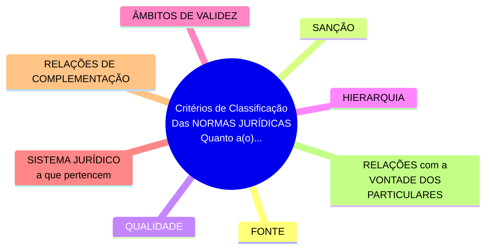
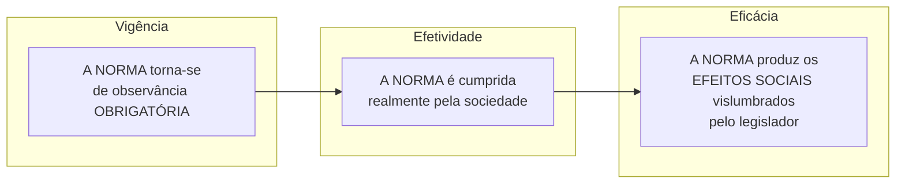

# Capítulo 09 - A Norma Jurídica

<table align="right" border="0">
  <tr>
    <td align="center" valign="top">
      <a href="https://github.com/dnlclaudino/introducao-ao-estudo-do-direito/tree/master/livro-NADER-2016-introducao-ao-estudo-do-direito#readme">
         Sumário da Fonte
      </a>
    </td>
    <td align="center" valign="top">
      <a href="https://github.com/dnlclaudino/introducao-ao-estudo-do-direito#readme">
         Início deste  Repositório
      </a>
    </td>
    <td align="center" valign="top">
         Baixar em PDF
    </td>
  </tr>
</table>     

## O conceito de norma jurídica[^SECAO-41]

- A **NORMA JURÍDICA** **<u>É IMPORTANTE</u>** PORQUE:
  - É elemento essencial do **DIREITO OBJETIVO**;
  - É ponto culminante no **PROCESSO DE ELABORAÇÃO DO DIREITO**;
  - É ponto de partida para **Dogmática Jurídica** sistematizar e descrever a **ORDEM JURÍDICA** vigente;
- **CONHECER o Direito** é CONHECER as **NORMAS JURÍDICAS**:
  - Em seu **ENCADEAMENTO LÓGICO**;
  - Em seu **ENCADEAMENTO SISTEMÁTICO**;
- Segundo **NADER (2011, p. 83)**, as **NORMAS JURÍDICAS**, também chamadas de **regras jurídicas**, estão para o Direito, assim como as células estão para os organismos vivos;
- O **Direito Positivo** deve expressar-se de forma **PRÁTICA** para promover a **ORDEM SOCIAL**, ou seja:
  - Deve REVELAR-SE mediante **NORMAS ORIENTADORAS de CONDUTAS INTERINDIVIDUAIS**;
- Para se **ALCANÇAR O EQUILÍBRIO EM SOCIEDADE**:
  - Não é suficiente que os homens estejam dispostos à prática de Justiça;
  - É necessário que se lhes indique a **FÓRMULA DE JUSTIÇA** que **satisfaça a sociedade em determinado momento histórico**;
  - É necessário que se lhes indique **COMO** e **QUANDO** agir;
- As expressões **NORMA JURÍDICA** e **REGRA JURÍDICA** são sinônimas;

<table>
  <tr>
    <td align="center">
        
       <b>Definição</b>
    </td>
    <td valign="top">
      A <b>NORMA JURÍDICA</b> é
      <ul>
        <li>A CONDUTA exigida;</li>
        <li>Um MODELO imposto de organização social;</li>
        <li>Um padrão de conduta;</li>
        <li>Um padrão de organização social;</li>
        <li>Uma fórmula de agir;</li>
        <li>Uma determinação que fixa PAUTA(S) de como será o <b>COMPORTAMENTO INTERINDIVIDUAL</b>;</li>
      </ul>
    </td>
  </tr>
</table>

- A **NORMA JURÍDICA** é **parte da ORDEM JURÍDICA**, devendo demonstar com ela:
  - Harmonia;
  - Coerência lógica;
  - Unidade de fim;

<table>
  <tr>
    <td align="center">
        
       <b>Não Cometa Erros</b>
    </td>
    <td valign="top">
      <b>NORMA JURÍDICA <u>NÃO É</u></b> a mesma coisa que <b>LEI</b>. A LEI é apenas <u><b>UM DAS FORMAS DE EXPRESSÃO</b></u> da <b>NORMA JURÍDICA</b>. Em alguns países, inclusive, as <b>NORMAS JURÍDICAS</b> se manifestam também:</b>
       <ul>
         <li> Pelo <b>DIREITO COSTUMEIRO</b>; e</li>
         <li> Pela <b>JURISPRUDÊNCIA</b></li>
       </ul>
    </td>
  </tr>
</table>

## Instituto Jurídico[^SECAO-42]

<table>
  <tr>
    <td align="center">
        
       <b>Definição</b>
    </td>
    <td valign="top">
      <b>INSTITUTO JURÍDICO</b>:
      <ul>
        <li>É a reunião de <u><b>NORMAS JURÍDICAS afins</b></u>;</li>
        <ul>
          <li>Que rege:
          <ul>
            <li>Um <b>TIPO DE RELAÇÃO SOCIAL</b></li>
            <li>Um <b>TIPO DE INTERESSE</b></li>
          </ul>
          <li>Se identifica pelo <b>FIM que procura realizar</b></li>
        </ul>  
      </ul>
    </td>
  </tr>
</table>

<table>
  <tr>
    <td align="center">
        
       <b>Definição</b>
    </td>
    <td valign="top">
      O <b>INSTITUTO JURÍDICO</b> se refere:
      <ul>
        <li>A um tipo de <b>RELAÇÃO SOCIAL</b></li>
        <li>A um tipo de <b>INTERESSE</b></li>
      </ul>
    </td>
  </tr>
</table>

- São EXEMPLOS de INSTITUTOS JURÍDICOS:
  - Adoção;
  - Poder Familiar;
  - Naturalização;
  - Hipoteca.

<table>
  <tr>
    <td align="center">
        
       <b>Definição</b>
    </td>
    <td valign="top">
      Um <b>RAMO JURÍDICO</b> são diversos <b>INSTITUTO JURÍDICOS</b> afins</b>
    </td>
  </tr>
</table>

<table>
  <tr>
    <td align="center">
        
       <b>Definição</b>
    </td>
    <td valign="top">
      A <b>ORDEM JURÍDICA</b> é um conjunto de <b>RAMOS JURÍDICOS</b>
    </td>
  </tr>
</table>

- A **ORDEM JURÍDICA** dispõem sobre a **GENERALIDADE** das **RELAÇÕES SOCIAIS**;

## ESTRUTURA LÓGICA da Norma Jurídica[^SECAO-43]

- A visão moderna da **ESTRUTURA LÓGICA** da norma juridica foi precedida pela **distincao kantiana** dos **imperativos categoricos e hipotético**;
- É importante, antes de compreender a **ESTRUTURA LÓGICA** atual da norma juridica, ter em mente a definição desses imperativos;

### Os IMPERATIVOS kantianos [^MUNDO-DA-FILOSOFIA-KANT]

<table>
  <tr>
    <td align="center">
        
       <b><a href="https://pt.wikipedia.org/wiki/Hans_Kelsen">Imanuel Kant</a> 1724-1804
    </td>
    <td valign="top">
      
<b>Immanuel Kant</b> foi filósofo Alemão do Século XVIII (1724-1804) considerado um dos mais importantes pensadores da tradição ocidental, com grandes contribuições nas áreas da ÉTICA, epistemologia, metafisica e estética;

    </td>
  </tr>
</table>

<table>
  <tr>
    <td align="center">
        
       <b>Definição</b>
    </td>
    <td valign="top">
      

<b>IMPERATIVO CATEGÓRICO</b>

      <ul>
        <li>É uma LEI baseada na RAZAO;</li>
        <li>É uma LEI UNIVERSAL;</li>
        <li>É uma LEI INCONDICIONAL;</li>
        <li>É uma LEI que DEVE SER SEGUIDA independente das consequencias;</li>
        <li>É próprio dos <b>PRECEITOS MORAIS</b></li>
        <li>É a EXPRESSÃO da LIBERDADE HUMANA;</li>
        <li>É expresso através da FÓRMULA: "**Age** apenas de acordo com **uma máxima** que possas ao mesmo tempo querer que se torne uma **lei universal**."</li>
      </ul>
    </td>
  </tr>
</table>

<table>
  <tr>
    <td align="center">
        
       <b>Definição</b>
    </td>
    <td valign="top">
      

<b>IMPERATIVO HIPOTÉTICO</b>

      <ul>
        <li>É baseado em uma CONDIÇÃO ou um OBJETIVO específico;</li>
        <li>É CONDICIONAL as consequências;</li>
        <li>É expresso através de uma FÓRMULA: Se...Então
        <li>Significa dizer que a AÇÃO é condicionada a um OBJETIVO ou META específica (Ex: <b>SE</b> queres ser feliz <b>ENTÃO</b> você deve <u>estudar</u></li>
        <li>É próprio da <b>NORMAS</b>:</li>
        <ul>
          <li>JURÍDICAS</li>
          <li>TÉCNICAS</li>
          <li>POLÍTICAS</li>
        </ul>
      </ul>
    </td>
  </tr>
</table>

<table>
  <tr>
    <td align="center">
        
       <b>Lembre-se</b>
    </td>
    <td valign="top">
      

<b>
</b>

      
Para <b>KANT</b>, seguir o <b>IMPERATIVO CATEGÓRICO</b> é o que nos torna SERES

      <ul>
        <li>Racionais;
        <li>Livres;</li>
        <li>Capazes de <b>AGIR DE ACORDO</b> com nossa própria:</li>
        <ul><li>Natureza <b>RACIONAL</b></li><li>Natureza <b>MORAL</b></li></ul>
      </ul>
    </td>
  </tr>
</table>

### Concepção de KELSEN

<table>
  <tr>
    <td align="center">
        
       <b><a href="https://pt.wikipedia.org/wiki/Hans_Kelsen">Hans Kelsen</a> 1881-1993 <b>Grande Pensador</b>
    </td>
    <td valign="top">
      
<b>QUEM FOI HANS KELSEN ?</b>

      
<b>Hans Kelsen</b> foi um jurista e filósofo austríaco.

      
No ocidente, especialmente nos países europeus e latino-americanos, é considerado um dos mais importantes e influentes estudiosos do Direito e o principal representante da chamada Escola Normativista do Direito, ramo da Escola Positivista.

      
Por volta de 1940, a reputação de Kelsen já estava bem estabelecida nos Estados Unidos, por sua defesa da democracia e pela <b>Teoria Pura do Direito</b>. A estatura acadêmica de Kelsen excedeu a teoria legal e alargou a filosofia política e teoria social. Sua influência abrange os campos da Filosofia, Direito, Sociologia, Teoria da Democracia e Relações Internacionais.

    </td>
  </tr>
</table>

- Para Kelsen, em sua obra *Teoria Pura do Direito*, a **estrutura lógica das normas jurídicas** pode ser enunciado da seguinte forma:

> "Em determinadas **circunstâncias**, um determinado sujeito deve observar tal ou qual conduta; se não a observa, outro sujeito, órgão do Estado, deve aplicar ao infrator um sanção." (Kelsen, Teoria Pura do Direito)

- A formulação Kelseniana possui **DUAS PARTES**:
  - Norma **SECUNDÁRIA**:
    - **Fórmula**: Dado **ñP**, deve ser **S**;
    - **Significado**: Dada a NÃO PRESTAÇÃO **(ñP)**, deve ser aplicada uma SANÇÃO **(S)**
    - **Exemplo**: O pai que não prestou assistência moral ou material ao filho menor deve ser submetido a uma penalidade.
  - Norma **PRIMÁRIA**:
    - **Fórmula**: Dado **Ft**, deve ser **P**;
    - **Significado**: Dado um FATO TEMPORAL **(Ft)**, deve ser feita a PRESTAÇÃO **(P)**
    - **Exemplo**: O pai que possui filho menor, deve prestar-lhe assistência moral e material

- Hans Kelsen fez distinção entre **PROPOSIÇÃO NORMATIVA** e **NORMA JURÍDICA**:
  - **PROPOSIÇÃO NORMATIVA**:
    - É a **LINGUAGEM** que descreve a **NORMA JURÍDICA**;
    - É um **JUÍZO HIPOTÉTICO** estruturado da seguinte forma:
      - Sob certas condições, <u>fixadas pelo ordenamento jurídico</u>, (...)
      - Deve haver certas consequências, <u>fixadas pelo mesmo ordenamento jurídico</u>,  (...)
  - **NORMA JURÍDICA**:
    - Não é considerada, para Kelsen, um JUÍZO LÓGICO;
    - É considerada um IMPERATIVO, um MANDAMENTO, um COMANDO;

### O Juízo Disjuntivo de CARLOS COSSIO

<table>
  <tr>
    <td align="center">
        
       <b><a href="https://pt.wikipedia.org/wiki/Carlos_Cossio">Carlos Cossio</a> 1903-1987
    </td>
    <td valign="top">
      
<b>QUEM FOI CARLOS COSSIO ?</b>

      
<b>Carlos Cossio</b> foi um militante universitário reformista, advogado, filósofo do Direito e professor argentino.

      
Sua obra basilar é Ideologia e Direito, desenvolvida a partir do conceito de fenomenología de la sentencia (fenomenologia da sentença), do processo de interpretação do juiz e da compreensão do Direito, dos aspectos ideológicos e da transformação de classe do Direito liberal capitalista.

      
Cossio aceita a Teoria Pura de Kelsen, tornando-a parte importante de sua própria teoria. Ainda assim, sempre houve tensão entre ambas as correntes.

      
Cossio aceitava o direito positivo, mas desacreditava o normativismo mecânico como objeto da ciência jurídica. O filósofo se distinguiu por demonstrar que o Direito deveria ser compreendido e interpretado mediante uma teoria do conhecimento, relativa ao respeito da conduta humana em interferência intersubjetiva. Já não se tratava de sujeitos jurídicos ideais (normativismo mecânico), mas sim de pessoas, de seres humanos reais. Era o direito como conduta humana.

    </td>
  </tr>
</table>

### A Estrutura da norma jurídica para carlos cossio

- Carlos Cossio concebeu a estrutura das normas jurídicas como um **JUÍZO DISJUNTIVO** composto de **DUAS PARTES**:
  - **ENDONORMA**: 
    - Corresponde o juízo que impõe uma PRESTAÇÃO (P) ao sujeito que encontra-se em determinada SITUAÇÃO (A);
    - Corresponde à **NORMA PRIMÁRIA** de Kelsen;
    - Exemplo: Um sujeito <u>assume uma dívida</u> (A), deve efetuar o <u>pagamento na época própria</u> (P)
  - **PERINORMA**
    - Impõe uma SANSÃO (S) ao infrator, isto é, ao sujeito que <u>não efetuou a PRESTAÇÃO a que estava obrigado</u> (ñP)
    - Corresponde à **NORMA SECUNDÁRIA** de Kelsen;
    - Exemplo: O devedor <u>não efetuou o pagamento na época própria</u> (ñP), <u>deverá pagar multa e juros</u>(S).

### Resumo do pensamento de Carlos Cossio

- Ele não concordou com o reduzido significado atribuído por Kelsen em relação à NORMA SECUNDÁRIA (Conduta obrigatória, lícita);
- Enquanto a **NORMA PRIMÁRIA** e **NORMA SECUNDÁRIA** de Kelsen se sobrepõe, a **ENDONORMA** e **PERINORMA** de Carlos Cossio se unem pela CONJUNÇÃO "OU" (Daí <u>Juízo Disjuntivo</u>) 

### Conclusões

- Para **Nader** (2016, p. 85) **não parece razoável dividir a estrutura da norma jurídica**;
  - Para o autor, seria como acreditar que a norma permite uma ALTERNATIVA para seu destinatário (adotar a conduta lícita OU submeter-se a sansão prevista);
  - A **violação da norma** <u>não pode ser facultada</u>;
  - Nesse sentido, a ordem jurídica possui até **dispositivos de proteção** que visam <u>impedir a violação de suas normas</u>;
- De acordo com **Nader** (2016, p. 85), **VISTA DE FORMA MAIS GENÉRICA**:
  - A **NORMA JURÍDICA** apresenta um **ESTRUTURA UNA** na qual a **SANSÃO** se integra;
  - A NORMA JURÍDICA apresenta com a seguinte FÓRMULA (ESQUEMA): SE "A" é, "B" deve ser, sob pena de "S"
  - Exemplo: <u>Quem é contribuinte do imposto de renda</u> (A), <u>deve apresentar declaração até determinada data</u> (B), <u>sob pena de incindir em multa</u> (S)

> "A": Corresponde a **SITUAÇÃO DE FATO**
> 
> "B": Corresponde a **CONDUTA EXIGIDA**
> 
> "S": Corresponde a **SANSÃO** aplicável, na eventualidade do não cumprimento de "B"

### Quadro das ESTRUTURAS LÓGICAS

- Trata-se de um QUADRO contendo um resumo da ESTRUTURAS LÓGICAS:
  - Morais
  - Jurídicas
  - Técnicas
  - Naturais

|   #   |  Norma   | Esquema                                             | Interpretação                                                                                                                  |
| :---: | :------: | :-------------------------------------------------- | :----------------------------------------------------------------------------------------------------------------------------- |
|   1   |  Moral   | Deve ser "**A**"                                    | Impõe-se a si próprio (**A**)                                                                                                  |
|   2   | Jurídica | Se "**A**" é, "**B**" deve ser, sob pena de "**S**" | Sob determinada CONDIÇÃO (**A**), deve-se agir de acordo com o que for previsto (**B**), sob pena de sofrer uma SANÇÃO (**S**) |
|   3   | Técnica  | Se "**A**" é, tem que ser "**B**"                   | Ao escolher UM FIM (**A**), tem-se que adotar um MEIO (**B**)                                                                  |
|   4   | Natural  | Se "**A**" é, é "**B**"                             | Ocorrida a CAUSA (**A**), ocorrerá o EFEITO (**B**)                                                                            |

## Caracteres (Características das NORMAS JURÍDICAS)[^SECAO-44]

- Para **Reale** (2004, p. 95)[^REALE-2004], O que efetivamente **CARACTERIZA** uma **NORMA JURÍDICA** de qualquer espécie:
  - É uma **ESTRUTURA PROPOSICIONAL ENUNCIATIVA** de uma **CONDUTA** ou **FORMA DE ORGANIZAÇÃO**;
  - Deve ser seguida de maneira **OBJETIVA** e **OBRIGATÓRIA**;

<table>
  <tr>
    <td align="center">
        
       <b>Verifique</b>
    </td>
    <td valign="top">
      <b>Exemplo de Norma Jurídica Peculiar (Difícil enquadramento em uma classificação)</b>:
      <ul>
        <li>Art. 579 do Código Civil: Definição de <b>COMODATO</b>:</li>
          <ul>
            <li>Empréstimo gratuito de coisa não fungível</li>
          </ul>
        <li>É um exemplo de uma NORMA JURÍDICA que <u>não encerra EM SI</u> mesma nenhuma determinação.</li>
      </ul>
    </td>
  </tr>
</table>

- Segundo **Nader** (2016, p. 86), as **CATEGORIAS MAIS GERAIS** de **NORMAS JURÍDICAS** possuem as seguintes CARACTERÍSTICAS:
  - Bilateralidade;
  - Generalidade;
  - Abstratividade;
  - Imperatividade;
  - Coercibilidade;

### Bilateralidade

- O Direito existe sempre:
  - **VINCULANDO** duas ou mais pessoas;
  - **ATRIBUINDO PODER** a uma parte;
  - **IMPONDO DEVER** a outra parte
- **Bilateralidade** significa que a **NORMA JURÍDICA** possuir essas **DUAS PARTES** (Uma <u>NÃO PODENDO EXISTIR</u> SEM A OUTRA):
  - **UMA PARTE**: Representada pelo **DIREITO SUBJETIVO**;
  - **OUTRA PARTE**: Representada pelo **DEVER JURÍDICO**;
- Em TODA RELAÇÃO JURÍDICA existe sempre:
  - Um **SUJEITO ATIVO**: Portador do **DIREITO SUBJETIVO**;
  - Um **SUJEITO PASSIVO**: Portador do **DEVER JURÍDICO**.

### Generalidade

- O princípio da generalidade revela que a **NORMA JURÍDICA** é um **PRECEITO**:
  - Preceito de **ORDEM GERAL**;
  - Preceito **OBRIGATÓRIO** a todos os que se acham em IGUAL SITUAÇÃO JURÍDICA.
- Sobre **IMPORTÂNCIA dessa característica**:
  - JURISCONSULTO Papiniano
    - Definição da Lei: [_Lex est generale praeceptum_](https://translate.google.com/?sl=auto&tl=pt&text=Lex%20est%20generale%20praeceptum&op=translate) ("A lei é um mandamento geral.")
  - Da **GENERALIDADE** da lei **SE DEDUZ** o **PRINCÍPIO DA ISONOMIA DA LEI** ("Todos são iguais perante a lei.)

### Abstratividade

- A NORMA JURÍDICA
  - É ABSTRATA para atingir o MAIOR NÚMERO DE SITUAÇÕES POSSÍVEIS;
  - REGULA casos dentro do seu DENOMINADOR COMUM (como ocorrem, via de regra)
- O que conteceria se a NORMA JURÍDICA de cidisse abandorar a ABSTRATIVIDADE ?
  - Ela tentaria alcançar os fatos em como eles ocorrem CAUSUÍSTICAMENTE (singularmente, em todas as suas variações);
  - Os códigos e as leis seriam muito mais EXTENSOS;
  - O LEGISLADOR não alcancaria seu OBJETIVO
    - A vida social é mais rica do que a imaginação do homem;
    - Cria sempre acontecimentos novos e imprevisíveis;
- Para **Benedetto Croce** (apud NADER, 2016, p. 87), em sua definição, a **LEI** "é um ato volitivo que tem por conteúdo uma série ou classes de ações."

<table>
  <tr>
    <td align="center">
        
       <b>Não cometa Erros</b>
    </td>
    <td valign="top">
      <b>A GENERALIDADE e a ABSTRATIVIDADE são ESSENCIAIS as NORMAS JURÍDICAS ?</b>:
      <ul>
        <li>Na lição de <b>Massina Bianca</b>:</li>
        <ul>
        <li>Embora sejam <b>CARACTERÍSTICAS TÍPICAS</b> das <b>NORMAS JURÍDICAS</b>, <b>NÃO</b> chegam a ser <b>ESSENCIAIS</b> a elas. </li>
        <li><b>Existem situações</b> em que as <b>NORMAS JURÍDICAS</b> são:</li>
        <ul>
          <li><b>INDIVIDUAIS</b></li>
          <li><b>CONCRETAS</b></li>
        </ul>
      </ul>
    </td>
  </tr>
</table>

### Imperatividade

- Na sua missão de (1) **DISCIPLINAR AS MANEIRAS DE AGIR EM SOCIEDADE** e (2) **GARANTIR EFETIVAMENTE A ORDEM SOCIAL**, o Direito:
  - Deve representar o mínimo de exigências, de determinações necessárias;
  - Deve se manifestar através de NORMAS de caráter IMPERATIVO;
- **SEM IMPERATIVIDADE** o Direito não lograria:
  - Segurança;
  - Justiça;
- **NORMAS** **SEM IMPERATIVIDADE**
  - **NÃO** podem ser jurídicas (NÃO POSSUEM JURIDICIDADE)
  - Exemplos (ocorridos durante a REVOLUÇÃO FRANCESA):
    - Normas relativas à **definição de bom cidadão**
    - Normas relativas à **existência de Deus**
- O **CARÁTER IMPERATIVO** da NORMA JURÍDICA:
  - Significa **IMPOSIÇÃO**;
  - **NÃO SIGNIFICA** mero **ACONSELHAMENTO**;
- São **MAIS FÁCEIS** de indentificar a **IMPERATIVIDADE**
  - Normas de tipo **PRECEPTIVO**;
  - Normas de tipo **PROIBITIVO**;
- São **MAIS DIFÍCEIS** de indentificar a **IMPERATIVIDADE**
  - Normas de tipo **EXPLICATIVO**;
  - Normas de tipo **DECLARATIVO**;
- Em **NORMAS EXPLICATIVAS** e **DECLARATIVAS** a **IMPERATIVIDADE EXISTE** A associação de **DUAS NORMAS**:
  - Na **VINCULAÇÃO** entre:
    - **NORMA SECUNDÁRIA**: **Explicativa** ou **Declarativa** ; e
    - **NORMA PRIMÁRIA**: Objeto da explicação ou definição

### Coercibilidade

- Significa POSSIBILIDADE de USO DA COAÇÃO, possuindo DOIS ELEMENTOS:
  - **PSICOLÓGICO**: Exerce a **INTIMIDAÇÃO**, através de **PENALIDADES** prevista para **hipótese de violação das normas jurídicas**;
  - **MATERIAL**: É a FORÇA PROPRIAMENTE que é acionada quando o destinatário da norma não a cumpre espontaneamente;

- COAÇÃO e SANÇÃO não se confundem

<table>
  <tr>
    <td align="center">
        
       <b>Não cometa Erros</b>
    </td>
    <td valign="top">
      <b>A COAÇÃO e a SANÇÃO não se confumdem</b>:
      <ul>
        <li>A <b>COAÇÃO</b>:</li>
        <ul>
          <li>É a <b>RESERVA DE FORÇA</b> à serviço do Direito.</li>
          <li>Exemplos de quando o juiz <b>aciona a força do Direito</b>:</li>
          <ul>
            <li>Quando o juiz determina a condução da testemunha _manu militari_; ou </li>
            <li>Quando ordena o leilão de bens do executado.</li>
          </ul>
        </ul>
       <li>A <b>SANÇÃO</b>:</li>
        <ul>
          <li>É a <b>MEDIDA PUNITIVA</b> para a <b>HIPÓTESE DE VIOLAÇÃO</b> de normas jurídicas.</li>
          <li>Exemplos de quando o juiz <b>aplicação uma sanção legal</b>:</li>
          <ul>
            <li>Quando o juiz condena o acusado a uma pena privativa de liberdade ou pecuniária.</li>
            <li>Quando o juiz condena o acusado a uma pena pecuniária.</li>
          </ul>
      </ul>
    </td>
  </tr>
</table>

- Alguns autores se referem, também, à chamada **SANÇÃO PREMIAL**, partindo do entendimento de que **SANÇÃO** é o estímulo à **EFETIVIDADE da NORMA JURÍDICA**;
- Denomina-se **SANÇÃO PREMIAL** o benefício conferido pelo ordenamento como **incentivo ao cumprimento de determinada obrigação**;
  - É o que se passa, por exemplo, quando uma **ação de despejo** apresenta **pedido de retomada para uso próprio**;
> A LEI, NESTA HIPÓTESE, OFERECE UM ESTÍMULO ESPECIAL: Se o locatário concorda com o pedido, <u>**pode permanecer no imóvel durante seis meses**</u> e **se livrar do ônus do pagamento de custas judiciais e de honorários advocatícios**, <u>caso entregue o imóvel dentro desse prazo</u>;

#### COAÇÃO é elemento essencial ao Direito ?

- Uma das indagações polêmicas que se apresentam na teoria do Direito refere-se à questão se a **COAÇÃO** <u>**é ou não elemento essencial ao Direito**</u>.

<b>CORRENTE #1</b>

  - Responde NEGATIVAMENTE;
  - Entende que a ATRIBUTIVIDADE é o ELEMENTO ESSENCIAL do Direito;
  - Entende que a ATRIBUTIVIDADE é CARACTERÍSTICA EXCLUSIVA do Direito (não presente em qualquer outra especie de norma, seja técnica, política ou moral)
  - Se a coação somente é acionada excepcionalmente, é um **FATOR CONTINGENTE**, e não um FATOR NECESSÁRIO;
  - Essencial é uma qualidade que não pode faltar a um objeto, sob pena de não existir como tal.

<table>
  <tr>
    <td align="center">
        
       <b>Definição</b>
    </td>
    <td valign="top">
      <b>ATRIBUTIVIDADE</b> o fato de o <b>DIREITO POSITIVO</b> conceder, ao <b>SUJEITO ATIVO</b> de uma RELAÇÃO JURÍDICA, o poder de AGIR e de EXIGIR do <b>SUJEITO PASSIVO</b> o <b>cumprimento da sua obrigação</b>.
    </td>
  </tr>
</table>

<b>CORRENTE #2</b>

- Dentre o rol de autores que defendem opinião contrária: **Ihering** e **Max Weber**;
  - Para **Ihering**:
    - O Direito sem a COAÇÃO “é um fogo que não queima; uma luz que não ilumina”;
  - Para **Max Weber**:
    - “o decisivo no conceito do direito é a existência de um quadro coativo”;
    - “o clã mesmo pode representar esse quadro coativo (nos casos de vingança de sangue e de lutas internas), quando rege de fato, para as formas de suas reações, ordenações de qualquer índole”.
    - **Max Weber** desconsidera o **DIREITO INTERNACIONAL PÚBLICO** como **RAMO JURÍDICO**, pois “não se pode designar por direito, em realidade, uma **ordem que se encontre garantida** apenas pela expectativa da REPROVAÇÃO e das REPRESÁLIAS DOS LESIONADOS;

## Classificação das Normas Jurídicas [^SECAO-45]

- Muitas são as classificações propostas por diferente autores;
- Classificar as NORMAS JURÍDICAS:
  - Implica em um **ESPÍRITO PRÁTICO**;
  - Possui sua **VALIDADE** revelada À MEDIDA QUE TRADUZ UMA **UTILIDADE TEÓRICO** OU **PRÁTICA**;

### Quanto ao SISTEMA JURÍDICO A QUE PERTENCEM

- Em relação a esse critério, as **NORMAS JURÍDICAS** podem ser:
  - **NACIONAIS**:
    - Obrigatórias no âmbito do Estado;
    - Fazem parte do **ORDENAMENTO JURÍDICO** do Estato;
    - É POSSÍVEL que uma **NORMA JURÍDICA** tenha aplicação **além do território** do Estado que a criou;
  - **ESTRANGEIRAS**:
    - Temos uma **NORMA JURÍDICA ESTRANGEIRA** quando em uma **RELAÇÃO JURÍDICA** existente em um Estado for **APLICÁVEL** uma **NORMA JURÍDICA PRÓPRIA** de **OUTRO ESTADO**;
  - **DE DIREITO UNIFORME**:
    - Temos uma **NORMA JURÍDICA DE DIREITO UNIFORME** quanto DOIS ESTADOS resolvem, MEDIANTE TRATADO, adotar INTERNAMENTE uma LEGISLAÇÃO PADRÃO;

### Quanto à FONTE

- De acordo com o SISTEMA JURÍCO a que pertencem as NORMAS JURÍDICAS podem ser:
  - **LEGISLATIVAS**:
    - São normas jurídicas **ESCRITAS**;
    - **Codificadas** em Lei que **emanam do PODER LEGISLATIVO**
    - **Codificadas** em decretos, medidas provisórias, etc. que **emanam do PODER EXECUTIVO**;
  - **CONSUETUDINÁRIAS**:
    - São as normas **NÃO ESCRITAS**, elaboradas espontaneamente **PELA SOCIEDADE**;
    - São **PRÁTICAS SOCIAIS CONSTUMEIRAS** (=**COSTUME** como **VALOR JURÍDICO**):
        - Reiteradas;
        - Constantes;
        - Uniformes;
        - Enraizadas na CONSCIÊNCIA POPULAR como REGRA OBRIGATÓRIA;
      - Sua importância varia de acordo com os SISTEMAS JURÍDICOS;
  - **JURISPRUDENCIAIS**:
    - São NORMAS JURÍDICAS criadas pelos TRIBUNAIS;
    - No SISTEMA JURÍDICO de tradição ROMANO-GERMÂNICO
      - A **jurisprudência** <u>não deve ser considerada</u> **FONTE FORMAL** do Direito
    - No SISTEMA JURÍDICO **COMMON LAW**, adotado pela INGLATERRA e ESTADOS UNIDOS, **OS PRECEDENTES JUDICIAIS** têm força normativa.

### Quanto aos diversos ÂMBITOS DE VALIDEZ

- Temos o **ÂMBITO ESPACIAL** de VALIDEZ:
  - GERAL:
    - São as que se aplicam em <u>**TODO**</u> O TERRITÓRIO nacional;
    - <b>São **SEMPRE** normas **FEDERAIS**</b>;
  - LOCAL:
    - São as que se aplicam em <u>**PARTE**</u> DO TERRITÓRIO nacional
    - <b>PODEM</b> ser normas <b>FEDERAIS</b>;
    - PODEM ser normas **ESTADUAIS** ou **MUNICIPAIS**;
- Temos o **ÂMBITO TEMPORAL** de VALIDEZ:
  - Normas de **VIGÊNCIA** por **PRAZO INDETERMINADO**
    - Quando a **VIGÊNCIA** <u>NÃO é</u> determinada na própria norma jurídica, ela tem **VIGÊNCIA POR PRAZO INDETERMINADO**;
  - Normas de **VIGÊNCIA** por **PRAZO DETERMINADO**;
    - Quando a **VIGÊNCIA** <u>É</u> determinada na própria norma jurídica
    - Ocorrem com menos frequência;
    - Nesse caso, são denominadas normas de vigência por **PRAZO DETERMINADO**;
- Temos o **ÂMBITO MATERIAL** de VALIDEZ:
  - Normas **de Direito Público**:
    - A **RELAÇÃO JURÍDICA** é de **SUBORDINAÇÃO**, com o Estado impondo o seu _imperium_
  - Normas **de Direito Privado**:
    - A **RELAÇÃO JURÍDICA** é de **COORDENAÇÃO**
- Temos o **ÂMBITO PESSOAL** de VALIDEZ:
  - **Normas GENÉRICAS**:
    - É uma característica das normas jurídicas;
    - Significa que a norma **se dirige a todos** que se acham na **MESMA SITUAÇÃO JURÍDICA**;
  - **Normas INDIVIDUALIZADAS**:
    - **DESIGNAM** a um ou a vários **MEMBROS** da **MESMA CLASSE,** individualmente determinados; ou
    - **FACULTAM** a um ou a vários **MEMBROS** da **MESMA CLASSE,** individualmente determinados;

### Quanto à HIERARQUIA

<table>
  <tr>
    <td align="center">
        
       <b>Definição</b>
    </td>
    <td valign="top">
     <ul>
      <li>As <b>NORMAS JURÍDICAS</b> guardam entre si:</li>
      <ul>
      <li>Uma hierarquia entre as diversas categorias;</li>
      <li>Uma ordem de subordinação entre as diversas categorias</li>
      </ul>
     </ul> 
    </td>
  </tr>
</table>

- Do ponto de vista da **HIERARQUIA**, as NORMAS JURÍDICAS dividem-se em:
  - Normas Jurídicas **CONSTITUCIONAIS**:
    - Estão no **PRIMEIRO PLANO** de hierarquia;
    - Provém de EMENDAS CONSTITUCIONAIS ou são originais da CONSTITUIÇÃO;
    - **CONDICIONAM A VALIDADE** de todas as outras NORMAS JURÍDICAS;
    - Têm o poder de revogar todas as outras NORMAS JURÍDICAS;
    - **QUALQUER NORMA JURÍDICA** <u>de categoria diversa</u>, ANTERIOR ou POSTERIOR à constitucional, <u>**não terá validade**</u> caso contrarie as disposições das NORMAS CONSTITUCIONAIS;
  - Normas Jurídicas **COMPLEMENTARES**:
    - Na ordem jurídica brasileira, há normas que se localizam em leis complementares à Constituição;
    - Na ordem jurídica brasileira, há normas que se localizam, hierarquicamente, entre as **NORMAS CONSTITUCIONAIS** e as **NORMAS ORDINÁRIAS**;
    - Sua APROVAÇÃO se dá de acordo com o **art. 69** do [CRFB 1988](https://www.planalto.gov.br/ccivil_03/constituicao/ConstituicaoCompilado.htm);
  - Normas Jurídicas **ORDINÁRIAS**:
    - São as leis, **art. 69** do [CRFB 1988](https://www.planalto.gov.br/ccivil_03/constituicao/ConstituicaoCompilado.htm);
    - São as medidas provisórias e leis delegadas.
  - Normas Jurídicas **REGULAMENTARES**:
    - São os decretos;
  - Normas Jurídicas**INDIVIDUALIZADAS**:
    - Tem **DENOMINAÇÃO** e **ESPÉCIE** sugeridas por **MERKEL**;
    - Abarcam uma grande variedade de **NEGÓCIOS JURÍDICOS**:
      - Testamentos;
      - Sentenças judiciais;
      - Contratos;
      - etc.

### Quanto a SANÇÃO

- Do ponto de vista da **SANÇÃO**, as NORMAS JURÍDICAS dividem-se em:
  - Normas Jurídicas **PERFEITAS** (leges PERFECTAE):
    - Quando prevê a **NULIDADE DO ATO**, na hipótese de sua violação;
  - Normas Jurídicas **MAIS DO QUE PERFEITAS** (leges PLUS QUAM PERFECTAE):
    - Quando além de **NULIDADE DO ATO**, estipular **PENA** para os casos de violação;
  - Normas Jurídicas **MENOS QUE PERFEITAS** (leges MINUS QUAM PERFECTAE):
    - Quando determina apenas a **PENA**, na hipótese de sua violação;
  - Normas Jurídicas **IMPERFEITAS** (leges IMPERFECTAE):
    - Quando <u>NÃO</u> PREVÊ **NULIDADE DO ATO**; e
    - Quando <u>NÃO</u> estipular **PENA** para os casos de violação;
    - Exemplo:
      - Normas relacionadas na Lei Complementar no 95, de 26.02.1998, relativamente às técnicas de elaboração, redação e alteração das
leis.

> "Art. 18. Eventual inexatidão formal de norma elaborada mediante processo legislativo regular não constitui escusa válida para o seu descumprimento." 
> 
<a href="https://www.planalto.gov.br/ccivil_03/leis/lcp/lcp95.htm">Lei Complementar nº 95/1998</a>

### Quanto à QUALIDADE

- De acordo com a classificação de **García Máynez**, do ponto de vista da **QUALIDADE**, as NORMAS JURÍDICAS podem ser:
  - **POSITIVAS** ou **PERMISSIVAS**:
    - São NORMAS JURÍDICAS que <u>permite</u> **AÇÃO** ou **OMISSÃO**;
  - **NEGATIVAS** ou **PROIBITIVAS**:
    - São NORMAS JURÍDICAS que <u>proibem</u> a **AÇÃO** ou **OMISSÃO**;

### Quanto às RELAÇÕES DE COMPLEMENTAÇÃO

- Do ponto de vista das **RELAÇÕES DE COMPLEMENTAÇÃO**, as NORMAS JURÍDICAS podem ser:
  - **PRIMÁRIAS**:
    - São NORMAS JURÍDICAS que são completadas por outras (normas secundárias)
  - **SECUNDÁRIAS**:
    - São NORMAS JURÍDICAS que <u>complementam as normas primárias</u>;
    - São **CLASSIFICADAS** em:
      - De iniciação, duração e extinção da vigência;
      - Declarativas ou explicativas;
      - Permissivas;
      - Interpretativas;
      - Sancionadoras.

### Quanto à VONTADE DAS PARTES

- De acordo com a classificação de **García Máynez**, do ponto de vista das **VONTADE DAS PARTES**, as NORMAS JURÍDICAS podem ser:
  - **TAXATIVAS** ou **COGENTES**:
    - Obrigam **INDEPENDENTEMENTE** da vontade das partes, por resguardarem os **INTERRESSES FUNDAMENTAIS da sociedade**;
  - **DISPOSITIVAS**:
    - Dizem respeito **APENAS** aos **INTERESSES DOS PARTICULARES**;
    - **Admitem a NÃO ADOÇÃO** de seus preceitos, **DESDE QUE** por **VONTADE EXPRESSA** das <u>partes interessadas</u>;

### Quanto à FLEXIBILIDADE ou ARBÍTRIO DO JUIZ

- As NORMAS JURÍDICAS:
    - Apresentam, normalmente, ABSTRATIVIDADE para alcançar o maior número de casos possíveis;
    - Apresentam **GRAUS DE ABSTRATIVIDADE**.

- Do ponto de vista das **FLEXIBILIDADE**, as NORMAS JURÍDICAS podem ser:
  - Normas **RÍGIDAS** ou **CERRADAS**:
    - Não deixam margem à discricionariedade do juiz;
    - Em alguns casos, **PODEM COMPROMETER A JUSTIÇA**, pois nem sempre há plena adequação da fórmula do legislador à exigência
do caso concreto;
      - Exemplo: Ainda convencido de que o jovem de **dezessete anos** possui discernimento e experiência, não pode considerá-lo
**imputável criminalmente**;
  - Normas **ELÁSTICAS** ou **ABERTAS**:
    - Expressam **CONCEITOS VAGOS E/OU AMPLOS**, como **boa-fé objetiva**, **justa causa**, quando caberá ao juiz <u>**decidir com equidade os casos concretos**</u>;
    - Confere-se ao julgador **CERTA MARGEM DE LIBERDADE** na definição da norma a ser aplicada;
    - São tratadas pela doutrina também por **CLÁUSULAS GERAIS**;

<table>
  <tr>
    <td align="center" width="100px">
        
       <b>Lembre-se</b>
    </td>
    <td valign="top">
     <ul>
      <li>Uma das <b>CARACTERÍSTICAS DO CÓDIGO CIVIL DE 2002</b> é a <b>adoção de diversas NORMAS DE TIPO ABERTO</b>, que
propiciam ao juiz uma contribuição pessoal na distribuição da justiça.</li>
      <li>O <b>PODER DISCRICIONÁRIO</b> do juiz, nesta tarefa, <b>NÃO É ILIMITADO</b>, pois <b>deve guiar-se</b> de acordo com:</li>
      <ul>
        <li>O senso comum;</li>
        <li>As regras da experiência;</li>
        <li>A orientação jurisprudencial;</li>
      </ul>
     </ul> 
    </td>
  </tr>
</table>

- Para entender o quadr NÃO COMETA ERROS, abaixo, explicando o que são CONCEITOS JURÍDICOS INDETERMINADOS leia o art. 927 do Código Civil:

> <b>Art. 927</b>. Aquele que, por ato ilícito (arts. 186 e 187), causar dano a outrem, fica obrigado a repará-lo.  
> <b>Parágrafo único</b>. Haverá obrigação de reparar o dano, independentemente de culpa, nos casos especificados em lei, ou quando a <u>atividade normalmente desenvolvida pelo autor do dano</u> <b>IMPLICAR</b>, por sua natureza, <u><b>risco para os direitos</b></u> de outrem. (griffo nosso) 
> 
<a href="https://www.planalto.gov.br/ccivil_03/leis/2002/l10406compilada.htm">Lei nº 10.406, de 10 de janeiro de 2002</a>

<table>
  <tr>
    <td align="center" width="100px">
        
       <b>Não Cometa Erros</b>
    </td>
    <td valign="top">
    
Distinção entre <b>CLÁUSULAS ABERTAS</b> e <b>CONCEITOS JURÍDICOS INDETERMINADOS</b>

     <ul>
      <li>Ambos contêm VAGUIDADE;</li>
      <li>Nos <b>CONCEITOS JURÍDICOS INDETERMINADOS</b>: A vaguidade (imprecisão) está <b>APENAS</b> na <b>HIPÓTESE</b>;</li>
      <ul>
        <li>Exemplo: Art. 927 do Código Civil</li>
        <ul>
          <li>A <b>HIPÓTESE</b> é vaga/ampla/imprecisa: Atividade exercida pelo autor do dano implicar em risco para direitos de outrem (exatamente quais atividades ?)</li>
          <li>A CONSEQUÊNCIA/DISPOSIÇÃO é precisa e específica: Caracterização da responsabilidade objetiva (a que independe de
dolo ou culpa)</li>
        </ul>
      </ul>
      <li>Nas <b>CLÁUSULAS ABERTAS</b>: A vaguidade (imprecisão) está na <b>HIPÓTESE</b> e na <b>CONSEQUÊNCIA/DISPOSIÇÃO</b>;</li>
      <ul>
        <li>A norma que atribui <b>FUNÇÃO SOCIAL DO CONTRATO</b> constitui <b>CLÁUSULA ABERTA</b>, pois:</li>
         <ul>
            <li> Deixa ao arbítrio do juiz a <b>CARACTERIZAÇÃO DA <u>HIPÓTESE</u></b> no caso concreto;</li>
            <li> NÃO define a <b><u>DISPOSIÇÃO</u></b> ou <b><u>CONSEQUÊNCIA</u></b> (que pode ser NULIDADE ou INDENIZAÇÃO).</li>
        </ul>
      </ul>
     </ul> 
    </td>
  </tr>
</table>

### Quanto ao MODO DE PRESENÇA no ordenamento jurídico

<table>
  <tr>
    <td align="center">
        
       <b><a href="https://pt.wikipedia.org/wiki/Rudolf_von_Ihering">Caspar Rudolf Von Ihering</a> 1818-1892
    </td>
    <td valign="top">
      
<b>QUEM FOI RUDOLF VON IHERING ?</b>

      
<b>Rudolf von Ihering</b> (Aurich, 22 de agosto de 1818 — Gotinga, 17 de setembro de 1892) foi um jurista alemão. Ocupa ao lado de Friedrich Karl von Savigny lugar ímpar na história do direito alemão, tendo sua obra grandemente influenciado a cultura jurídica em todo o mundo ocidental.

      
Conhece a escritora e feminista Auguste von Littrow, falecida em 1889, a quem dedicou a primeira edição do célebre opúsculo “A Luta pelo Direito” (em alemão: "Der Kampf ums Recht"). Que foi reeditado 12 vezes em dois anos e foi traduzida em 26 línguas, incluindo o português..

    </td>
  </tr>
</table>

- Já vigorou a IDEIA (**JUSPOSITIVISTA**) do **PRINCÍPIO DA SUFICIÊNCIA DOS CÓDIGOS**, onde acreditava-se que esses <u>**NÃO APRESENTAVAM LACUNAS**</u>;
- Com o tempo, a experiência foi revelando **ESPAÇOS EM BRANCO** na legislação;
- Surgiu a **IDEIA DO DIREITO IMPLÍCITO** (Autor Rudolf Von Ihering)
  - Clóvis Beviláqua: “... existem regras latentes, cuja aplicação se faz, por assim dizer, inconscientemente, que completam os preceitos expressamente formulados”

- Do ponto de vista do **MODO DE PRESENÇA** no ordenamento jurídico, as NORMAS JURÍDICAS podem ser:
  - Normas Jurídicas **EXPLÍCITAS**:
    - Objetivamente definem a CONDUTA, PROCEDIMENTO ou MODELO DE ORGANIZAÇÃO;
  - Normas Jurídicas **IMPLÍCITAS**:
    - Complementam **FÓRMULAS** adotadas diretamente pelo legislador;
    - Na revelação dessas normas temos **PROCEDIMENTOS DE INTEGRAÇÃO DO DIREITO**;
      - Valiosa é a contribuição da **DOUTRINA**;
      - Valiosa é a contribuição da **JURISPRUDÊNCIA**;

- Para os adeptos do **POSITIVISMO JURÍDICO**:
  - Seriam **deduções normativas** de princípios consagrados pelo legislador;
- Para os **JUSNATURALISTAS**:
  - Tais normas seriam **irradiações da ordem natural das coisas**, <u>especialmente</u> da natureza humana;

- Para Nader (2011, p. XX), por **PRINCÍPIO DE COERÊNCIA LÓGICA** do sistema, que tais normas **DEVEM SER** apuradas tomando-se por paradigma os **critérios consagrados** no **código** e nas **leis**, avultando de **IMPORTÂNCIA O PROCEDIMENTO ANALÓGICO**.

### Quanto à INTELIGIBILIDADE

- Do ponto de vista do **INTELIGIBILIDADE** no ordenamento jurídico, ou seja, do **processo de compreensão da norma jurídica**, as NORMAS JURÍDICAS podem ser:
  - **NORMAS DE PERCEPÇÃO IMEDIATA**:
    - São **diretamente assimiladas** pelo espírito cognoscente;
    - O intérprete capta diretamente o **SENTIDO** e o **ALCANCE** da norma sem esforço intelectual;
    - O **MÉTODO** utilizado é o **INTUITIVO**;
    - **SE A NORMA É DE PERCEPÇÃO IMEDIATA** <u>não se justifica</u> a busca da interpretação
      - Pelo aproveitamento de recursos metodológicos; ou
      - Pelo Direito Comparado.
  - **NORMAS DE PERCEPÇÃO REFLEXIVA OU MEDIATA**:
    - O intérprete utiliza-se basicamente dos MÉTODOS **DEDUTIVO** E **INDUTIVO**;
  - **NORMAS DE PERCEPÇÃO COMPLEXA**:
    - Ao alcance apenas da classe (alguns) dos juristas;
    - Daqueles que possuem **CONHECIMENTO DO SISTEMA JURÍDICO**;
    - Daqueles que se acham **AFINADOS COM A TELEOLOGIA DOS INSTITUTOS JURÍDICOS**;
    - O intérprete impõe toda a sua acuidade intelectual a fim de apurar o **SENTIDO** e o **ALCANCE** das normas dessa espécie;
    - O interprete recorre:
      - Aos princípios gerais de Direito;
      - Aos elementos históricos;
      - Aos elementos da lógica externa (Se revela nos usos e na organização social)
      - Ao Direito Comparado.

## VIGÊNCIA, EFETIVIDADE, EFICÁCIA e LEGITIMIDADE da NORMA JURÍDICA[^SECAO-46]

- O estudo sobre a **NORMA JURÍDICA** não estará completo **se não for acompanhado** da abordagem dos atributos:
  - Vigência;
  - Efetividade;
  - Eficácia (:eight_spoked_asterisk:); e
  - Legitimidade

### Vigência da Norma Jurídica

- Para a NORMA JURÍDICA produzir efeitos é indispensável que:
  - Ela possua VIGÊNCIA (validade FORMAL)
- SÓ QUANDO uma NORMA possui VIGÊNCIA é que ela ingressou no ORDENAMENTO JURÍDICO
  - VALIDADE FORMAL = VIGÊNCIA
  - VALIDADE FORMAL significa que a NORMA SOCIAL:
    - Preenche os requisitos técnicos-formais;
    - Imperativamente se impõe aos destinatários;
    - Foi emanada do PODER LEGITIMADO;
    - Satisfaz PRESSUPOSTOS EXTRÍNSECOS de VALIDEZ (trâmite prescrito, agente legítimo, etc.)

### Efetividade da Norma Jurídica

- Efetividade é a OBSERVÂNCIA da NORMA JURÍDICA:
  - Por seus destinatários;
  - Pelos aplicadores do Direito;
- A **EFETIVIDADE** **não é** a mesma coisa que **EFICÁCIA**;
- NORMAS JURÍDICAS são feitas para SEREM CUMPRIDAS (=**EFETIVIDADE**)
  - Busca-se sua MÁXIMA EFETIVIDADE;
  - Em razão de fatores diversos, isto não ocorre, daí podermos falar em níveis de efetividade
- Para o austríaco **Hans Kelsen** a **validade** da norma pressupõe a sua **efetividade**.

### Eficácia da Norma Jurídica

- As normas jurídicas não são geradas por acaso, mas **VISANDO A ALCANÇAR CERTOS RESULTADOS SOCIAIS**.
- O Direito é um processo de adaptação social;
- O Direito elabora fórmulas (NORMAS JURÍDICAS) capaz de resolver:
  - Problemas de convivência; e
  - Problemas de organização da sociedade
- O atributo **EFICÁCIA** significa que a NORMA JURÍDICA produz, realmente, os **EFEITOS SOCIAIS PLANEJADOS** e seja **OBSERVADA SOCIALMENTE**..

<b>Figura:</b> Algumas características das normas relacionadas sequencialmente 

<b>Fonte: Própria do autor</b>

### Legitimidade da Norma Jurídica

- Esse atributo é objeto de estudo da FILOSOFIA DO DIREITO;
- Para um **POSITIVISTA**, na abordagem da norma é suficiente o exame de seus **ASPECTOS EXTRÍNSECOS (VIGÊNCIA)** (= aspectos TÉCNICOS-FORMAIS).
  - A pesquisa afeta ao **SISTEMA DE LEGITIMIDADE** seria algo **estranho à instância jurídica**
- Via de regra, o **PONTO DE REFERÊNCIA** na pesquisa da **LEGITIMIDADE** é o exame da **FONTE** de onde emana a norma;
  - SE a FONTE é **LEGÍTIMA**, a NORMA também será **LEGÍTIMA**;
  - A expressão **FONTE LEGÍTIMA** depende do SISTEMA JURÍDICO ADOTADO
    - **No CIVIL-LAW**: Seria a constituída pelos **REPRESENTANTES** escolhidos pelo povo ou então **PELO PRÓPRIO POVO**, no exercício da chamada <u>democracia direta</u>.
    - **Em sistema jurídicos religiosos** como o ISLÃMICO: A fonte legitimadora é a DIVINA
    - Adicionalmente, **OUTRA FONTE** poderá ser apontada como **INSTÂNCIA LEGITIMADORA**.
    - Para um **JUSNATURALISTA**: A **NATUREZA HUMANA** como a fonte criadora dos princípios que
configuram o **DIREITO NATURAL** e devem fornecer a estrutura básica do **DIREITO POSITIVADO**.

## Referências Bibliograficas

[^MUNDO-DA-FILOSOFIA-KANT]: MUNDO DA FILOSOFIA. O que é Imperativo Categórico e Hipotético em Immanuel Kant? Disponivel em: <https://mundodafilosofia.com.br/o-que-e-imperativo-categorico-e-hipotetico-em-immanuel-kant/> Acesso em: 08 dez. 2023
[^REALE-2004]: REALE, Miguel. Lições Preliminares de Direito. 27. ed. São Paulo: Saraiva: 2004.

[^SECAO-41]: 41 – Mouchet y Zorraquin, Introducción al Derecho;

[^SECAO-42]: 42 – Vicente Ráo, O Direito e a Vida dos Direitos; Benjamim de Oliveira Filho, Introdução à Ciência do Direito;

[^SECAO-43]: 43 – Hans Kelsen, Teoria Pura do Direito; Aftalion, Olano e Vilanova, Introducción al Derecho; Miguel Reale, Lições Preliminares de Direito; Machado Netto, Compêndio de Introdução à Ciência do Direito;

[^SECAO-44]: 44 – Alessandro Groppali, Introdução ao Estudo do Direito; Goffredo Telles Júnior, Filosofia do Direito;

[^SECAO-45]: 45 – Eduardo García Máynez, Introducción al Estudio del Derecho; Machado Netto, Compêndio de Introdução à Ciência do Direito;

[^SECAO-46]: 46 – Miguel Reale, Lições Preliminares de Direito; Elías Díaz, Sociología y Filosofía del Derecho; Luiz Diez Picazo, Experiencias Jurídicas y Teoria del Derecho; Paulo Nader, Filosofia do Direito.
