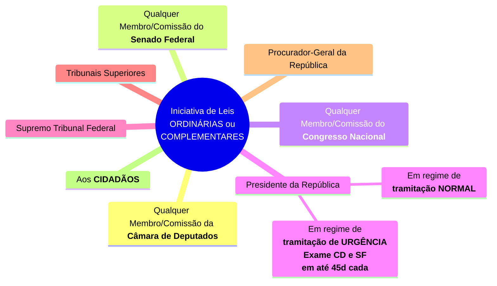
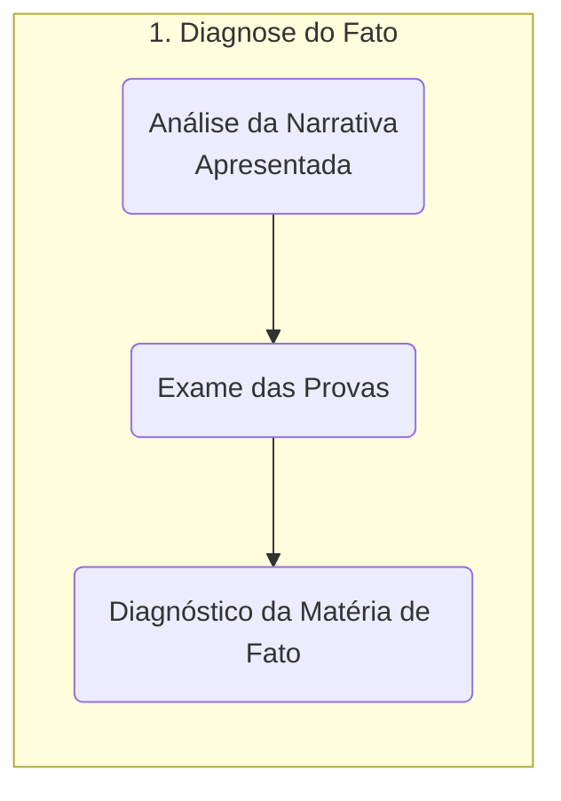
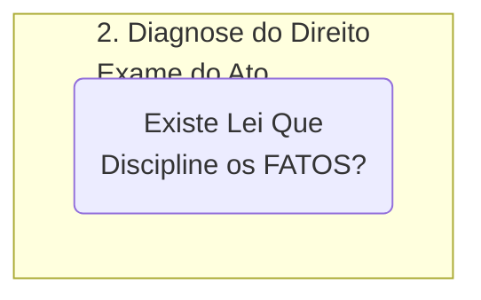
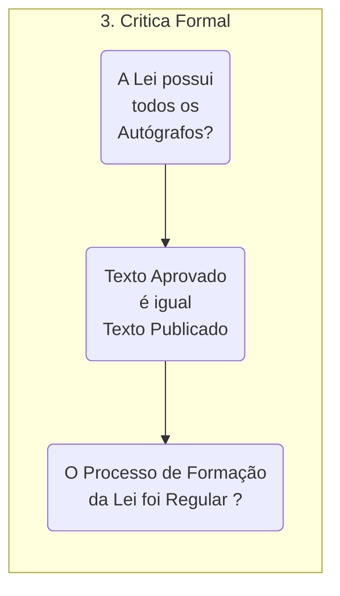
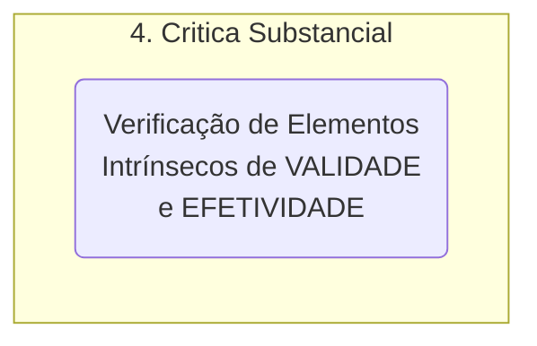
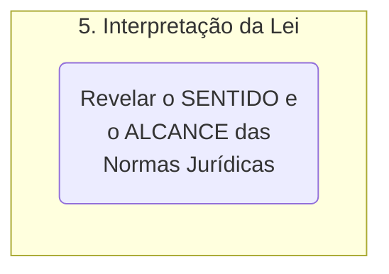
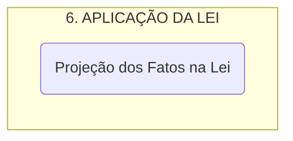

<table align="right" border="0">
  <tr>
    <td align="center" valign="top">
      <a href="https://github.com/dnlclaudino/introducao-ao-estudo-do-direito/tree/master/livro-NADER-2016-introducao-ao-estudo-do-direito#readme">
         Sumário da Fonte
      </a>
    </td>
    <td align="center" valign="top">
      <a href="https://github.com/dnlclaudino/introducao-ao-estudo-do-direito#readme">
         Início deste  Repositório
      </a>
    </td>
    <td align="center" valign="top">
         Baixar em PDF
    </td>
  </tr>
</table>     

# Capítulo 14 - A Lei

<!-- TOC -->

- [Capítulo 14 - A Lei](#capítulo-14---a-lei)
    - [Fontes do Direito](#fontes-do-direito)
        - [Aspectos Gerais](#aspectos-gerais)
        - [Fontes Históricas](#fontes-históricas)
        - [Fontes Materiais](#fontes-materiais)
        - [Fontes Formais](#fontes-formais)
    - [O Direito Romano](#o-direito-romano)
    - [Conceito e Formação da Lei](#conceito-e-formação-da-lei)
        - [Considerações Prévias](#considerações-prévias)
        - [Etimologia do Vocábulo Lei](#etimologia-do-vocábulo-lei)
        - [Lei em Sentido Amplo](#lei-em-sentido-amplo)
        - [Lei em Sentido Estrito](#lei-em-sentido-estrito)
            - [A Lei para os romanos](#a-lei-para-os-romanos)
            - [A Lei para Tómas de Aquino](#a-lei-para-tómas-de-aquino)
            - [A Lei para Crisipo, o estoico](#a-lei-para-crisipo-o-estoico)
            - [A Lei para Isidoro de Servilha (As virtudes da Lei)](#a-lei-para-isidoro-de-servilha-as-virtudes-da-lei)
            - [A Lei para Montesquieu](#a-lei-para-montesquieu)
        - [Lei em Sentido Formal e em Sentido Formal-Material](#lei-em-sentido-formal-e-em-sentido-formal-material)
        - [Lei Substantiva, Lei Adjetiva e os INSTITUTOS UNOS](#lei-substantiva-lei-adjetiva-e-os-institutos-unos)
        - [Leis de Ordem Pública](#leis-de-ordem-pública)
        - [Formação da Lei - O Processo Legislativo](#formação-da-lei---o-processo-legislativo)
            - [Iniciativa da Lei](#iniciativa-da-lei)
            - [Exame pelas Comissões Técnicas, Discussões e Aprovação](#exame-pelas-comissões-técnicas-discussões-e-aprovação)
            - [Revisão do Projeto](#revisão-do-projeto)
            - [Sanção](#sanção)
            - [Promulgação](#promulgação)
            - [Publicação](#publicação)
            - [Lei Delegada](#lei-delegada)
    - [Obrigatoriedade da Lei](#obrigatoriedade-da-lei)
        - [Teorias sobre a Obrigatoriedade da Lei](#teorias-sobre-a-obrigatoriedade-da-lei)
    - [Aplicação da Lei](#aplicação-da-lei)
        - [Diagnose do Fato](#diagnose-do-fato)
        - [Diagnose do Direito](#diagnose-do-direito)
        - [Crítica Formal](#crítica-formal)
        - [Crítica Substancial](#crítica-substancial)
        - [Interpretação da Lei](#interpretação-da-lei)
        - [Aplicação da Lei](#aplicação-da-lei)
    - [Referências Bibliográficas do Capítulo](#referências-bibliográficas-do-capítulo)

<!-- /TOC -->

## Fontes do Direito

### Aspectos Gerais

- Não existe uma UNANIMIDADE na doutrina jurídica quando se fala em FONTES DO DIREITO, principalmente em relação ao ELENCO (ENUMERAÇÃO) DAS FONTES;
- A **palavra FONTE** provem do latim _fons_, _fontis_ que significa **nascente de água**;
  - A fonte de um rio é o local de onde suas águas saem da terra
  - Buscar a **fonte de uma NORMA JURÍDICA** é buscar o ponto pelo qual ela sai da **VIDA SOCIAL** para aparecer na superfício do Direito;
- Para **Nader (2016, p. 141)**[^NADER-2016], existem **<u>TRÊS ESPÉCIES</u> DE FONTES DO DIREITO**:
  - Fontes históricas;
  - Fontes materiais;
  - Fontes formais;

### Fontes Históricas

- O Direito contém muitas **IDEIAS** que **<u>MUDAM</u>** **NO TEMPO** e **NO ESPAÇO**;
- **<u>APESAR DISSO</u>**, o Direito também contém muitas **IDEIAS** e **PRINCÍPIOS** que **PERMANECEM ATRAVÉS DO TEMPO**;
  - **<u>NOVAS FORMAS DE APLICAÇÃO</u>** desses **PRINCÍPIOS** e **IDEIAS** são realizadas pelo LEGISLADOR em razão da **EVOLUÇÃO DOS COSTUMES** e do **PROGRESSO**;
- A **IMPORTÂNCIA DAS FONTES HISTÓRICAS** do Direito é **SIGNIFICATIVA**:
  - Para memorização do Direito;
  - Para melhor compreensão das normas jurídicas da atualidade;
    - No **campo da interpretação** do Direito **<u>É FUNDAMENTAL</u>** **compreender**:
      - A **FINALIDADE** da norma jurídica;
      - A **ESSÊNCIA** da norma jurídica;
      - Os **VALORES PRINCIPAIS** da norma jurídica;
- A **DOGMÁTICA JURÍDICA** estuda o Direito a partir do **ORDENAMENTO JURÍDICO VIGENTE**;
  - Nessa perspectiva, **o estudo do DIREITO ROMANO**, como fonte do Direito ocidental **torna-se imperativo**;

### Fontes Materiais

- O Direito
  - **<u>NÃO É</u>** um **PRODUTO ARBITRÁRIO** da vontade do **legislador**;
  - É uma criação que TEM ORIGEM na VONTADE SOCIAL;
- A **SOCIEDADE**:
  - É o centro das relações de vida;
  - É a sede dos acontecimentos que envolvem o homem;
  - É a **CAUSA** produtora do Direito;
  - É quem fornece ao LEGISLADOR os **ELEMENTOS NECESSÁRIOS** à **formação das NORMAS JURÍDICAS**;
- As **FONTES MATERIAIS**:
  - São constituídas pelos
    - **FATOS SOCIAIS**;
    - **FATORES DO DIREITO** (Problemas que emergem da sociedade)
      - Moral;
      - Economia;
      - Geografia;
      - etc. (para saber mais, veja o capítulo 6 - Fatores do Direito)
  - Para **Gallo (1923, p. 180)**[^GALLO-1923], as **FONTES MATERIAIS** do Direito são:
    - **Fontes DIRETAS**:
      - Os órgãos elaboradores do Direito Positivo:
        - A sociedade, no Direito Consuetudinário;
        - O Poder Legislativo, que elabora as leis;
        - O Judiciário que produz a jurisprudência;
    - **Fontes INDIRETAS**:
      - São os FATORES JURÍDICOS (para saber mais, veja o capítulo 6 - Fatores do Direito)

### Fontes Formais

- As **FONTES FORMAIS**:
  - São as formas de **EXPRESSÃO DO DIREITO**;
  - São as formas pelas quais as **NORMAS JURÍDICAS**:
    -  Se EXTERIORIZAM;
    -  Se TORNAM CONHECIDAS;
- **CRIAR O DIREITO** significa **INTRODUZIR** no ordenamento jurídico **NOVAS NORMAS JURÍDICAS**;
- **QUEM** possui a capacidade de **CRIAR NOVAS NORMAS JURÍDICAS** ?
  - A relação de FONTES FORMAIS varias de acordo com
    - O **SISTEMA JURÍDICO**:
      - Paises que seguem a **tradição ROMANO-GERMÂNICA** (Direito legislado, **Civil law**)
      - Paises que seguem a **tradição BRITÂNICA** (Direito do caso, **Common law**)
    - A **FASE HISTÓRICA** do sistema jurídico.
- Para **Nader (2016, p. 143)**[^NADER-2016], existem:
  - Fontes **FORMAIS DIRETAS**:
    - Direito escrito (**A LEI**): A aplicação de normas jurídicas;
    - Para Nader (2016, p. 143)[^NADER-2016], tem se admitido ainda como FONTE FORMAL do Direito, pois criam regras de Direito Objetivo:
      - ATOS JURÍDICOS
      - ATOS-REGRAS
        - Não possuem generalidade;
        - Atingem um contingente de indivíduos
        - Exemplos:
          - Contratos particulares;
          - Contratos públicos;
          - Estatutos;
  - Fontes **INDIRETAS**:
    - NÃO cria o Direito (normas jurídicas);
    - Fornece SUBSÍDIOS ao jurista para compreender a norma jurídica;
    - É a DOUTRINA;
    - É a JURISPRUDÊNCIA;
    - É o COSTUME (No Direito legislado, **Civil law**)
- Para Reale (141, p. 141):
  - Toda **FONTE DO DIREITO** pressupõe uma ESTRUTURA DE PODER:
    - A **LEI** é a emanação do **PODER LEGISLATIVO**;
    - O **COSTUME** (no Commom Law) é a expressão do **PODER SOCIAL**;
    - Os **ATOS-REGRAS** é a expressão do **PODER NEGOCIAL** ou da **AUTONOMIA DA VONTADE** (FONTE NEGOCIAL)

## O Direito Romano

- Apresenta-se neste item uma **VISÃO GLOBAL** do **Direito Romano** devido a sua **importância** e **influência**
  - Para os ORDENAMENTOS JURÍDICOS do mundo OCIDENTAL;
    - Notadamente, no **DIREITO PRIVADO**;
  - No ramo do DIREITO PRIVADO para compreensão de
    - Sua ORGANIZAÇÃO;
    - Seus PRINCÍPIOS;
    - Suas CARACTERÍSTICAS fundamentais.
- A CULTURA JURÍDICA DOS ROMANDOS não teria alcançado seu nivel elevado sem o apoio de uma SEGURA ORIENTAÇÃO FILOSÓFICA;
  - Os juristas romanos receberam influência do ESTOICISMO
    - Juristas ESTOICOS:
      - Cícero;
      - Sêneca
      - Marcos Aurélio
      - Epíteto
  - A influência e o sucesso da repercussão da **DOUTRINA ESTÓICA** em Roma são devidos as necessidades de:
    - Sustentar, na esfera POLÍTICA, a **ideia do ESTADO ÚNICO**;
    - Consolidar uma **DOUTRINA ÉTICA**

<table border="1" id="quadro-verifique-periodos-historicos-civilizacao-romana">
  <tr>
    <td valign="top" align="center" width="140px">
       
      <b>Verifique</b>
    </td>
    <td valign="top">
     
Para melhor compreensão da <b>visão geral do Direito Romano</b> abordada neste item, verifique as duas imagens abaixo contendo (1) os principais <a href="#figura-roma-antiga-principais-periodos"><b>períodos históricos</b> da civilização romana</a> e (2) <a href="#figura-fases-direito-romano">as <b>fases do direito romano</b></a>.

    </td>
  </tr>
</table>

<b name="figura-roma-antiga-principais-periodos">Figura:</b> Roma Antiga - Principais Períodos 

<b>Fonte:</b> NOVAES, Roberto. Periodização da História e seus limites. 2024. 1 imagem no formato PNG. Disponível em: <a href="https://www.robertonovaes.com.br/index.php/2018/08/18/historia-interna-e-historia-externa-periodizacao-instituicoes-de-direito-romano/">robertonovaes.com.br</a> Acesso em: 11 jan. 2024

<b name="figura-fases-direito-romano">Figura:</b> Fases do Direito Romano 

<b>Fonte:</b> FACULDADE DE DIREITO UFRGS. <b>Direito Romano - Linhas do Tempo</b>. 2024. 1 imagem no formato PNG. Elaborado por: Gustavo U. Lacerda. Prof. Dalva Carmem Tonato (coord., rev.). Disponível em: <a href="https://prezi.com/p/c1yjvedsl-su/linhas-do-tempo-direito-romano/">prezi.com</a> Acesso em: 11 jan. 2024 

- As referências ao **DIREITO ROMANO**:
  - Compreendem ao **PERÍODO** entre **754 a.C.** e **565 d.C.**;
  - Abrangem **TRÊS FASES** <u>**do Direito Romano**</u>:
    - Direito ANTIGO ou CLÁSSICO (**754 a.C.** a **126 a.C**)
    - Direito CLÁSSICO (**125 a.C.** a **305 d.C.**)
    - Direito PÓS-CLÁSSICO (**306 d.C.** a **565 d.C.**)
  - Abrangem **TRÊS FASES** <u>**da HISTÓRIA DA CIVILIZAÇÃO ROMANA**</u> na Antiguidade:
    - Período **RÉGIO**
      - Período: da fundação de roma ATÉ 510 a.C.;
      - O Direito Positivado (_Jus Positum_) era o **COSTUMEIRO** e o **RELIGIOSO** (**ligado à RELIGIÃO**, conhecido como _jus fas_);
      - Quem dizia o Direito (a Jurisdição/"Juiz") era o **PONTÍFICE** exercendo o monopólio da jurisdição;
    - Período **REPUBLICANO**
      - Período: 510.a.C ATÉ 27 a.C.;
      - O **DIREITO LAICO** (direito sem a religião) e o **DIREITO RELIGIOSO**(_jus fas_) **<u>se separam</u>**;
      - Surgimento da classe dos **JURISCONSULTOS LEIGOS**;
    - Período do **PRINCIPADO**
      - Período: 27 a.C. (Imperador Augusto) ATÉ 285 d.C. (Diocleciano);
      - Período considerado como MONARQUIA ATENUADA;
      - Conhecido como período de transição entre a REPÚBLICA e a MONARQUIA ABSOLUTA (DOMINATO);
      - As FONTES DO DIREITO eram
        - Os COSTUMES;
        - Leis (em sentido estrito);
        - Édito dos MAGISTRADOS (Éditos Pretorianos);
        - Os SENATUS-CONSULTUM;
        - As CONSTITUIÇÕES IMPERIAIS;
        - As "_RESPONSA PREDENTIUM_":
          - Eram pareceres dos JURISCULSULTOS (...)
    - Período DOMINATO ou da MONARQUIA ABSOLUTA

## Conceito e Formação da Lei

### Considerações Prévias

- A **LEI**:
  - É a fonte de produção do DIREITO POSITIVO;
  - É ATO do PODER LEGISLATIVO (que estabelece normas de acordo com os INTERESSES SOCIAIS);
  - NÃO constitui expressão do INTERESSE INDIVIDUAL (como no Antigo Regime, Monarquias Absolutistas)
  - Traduz as **ASPIRAÇÕES COLETIVAS**;
  - **<u>NÃO</u>** tem por BASE a **RAZÃO** !!!;
    - Embora seja uma **ELABORAÇÃO INTELECTUAL** que exige **TÉCNICA ESPECÍFICA**;
  - Sua **FONTE MATERIAL**:
    - É representada por **fatos** e **valores** **<u>sociais</u>**;
- É através da LEI:
  - Que a CIÊNCIA DO DIREITO poderá aperfeiçoar as INSTITUIÇÕES JURÍDICAS;
- A **LEI**:
  - Possui **PONTOS VULNERÁVEIS** e **CRÍTICOS**;
  - Possui **DOIS ASPECTOS** **NEGATIVOS**:
    - **DECRETISMO**
      - Significa: O EXCESSO DE LEIS;
    - **VÍCIOS DO PARLAMENTARISMO**
      - Há no parlementarismo:
        - O não atendimento de interesses que não são os do povo;
        - Improdutividade em razão de discussões inúteis;
        - O não atendimento de exigências dos tempos modernos;
  - Para superar as DEFICIÊNCIAS da LEI, surgiu a **corrente do DIREITO LIVRE**:
    - Pregava o VALOR RELATIVO da lei;
    - Alguns juristas pretenderam substituir a lei:
      - Pelo Direito científico (A DOUTRINA);
      - Pelo Direito Judicial
- <b>SE HÁ DEFEITOS NA PRODUÇÃO DO DIREITO MEDIANTE LEIS</b>:
  - As **FALHAS**:
    - **SERIAM MAIORES** se consagrado o **DIREITO LIVRE** ou **DECISIONISMO**;
    - **<u>NÃO</u> SÃO** decorrentes do **PROCESSO LEGISLATIVO**;
    - Podem ser **SUPRIMIDAS**:
      - Mediante <b>**RACIONALIZAÇÃO DE SUAS CAUSAS**</b>;
      - Pela ação positiva do **_homo juridicus_**;

- As **VANTAGENS** que a lei oferece do **PONTO DE VISTA** da **SEGURANÇA JURÍDICA**:
  - Fazem **TOLERÁVEL** um coeficiente mínimo de **DISTORÇÕES** na **ELABORAÇÃO DO <u>DIREITO OBJETIVO</u>**;

### Etimologia do Vocábulo Lei

- A palavra lei possui origem em **TRÊS** possíveis verbos:
  - **LEGERE (Ler)**
    - Os antigos tinham o costume de
      - Se REUNIR em local ou praça pública;
      - Nesse local, AFIXAVAM cópias das leis para LEITURA e COMENTÁRIO de novos atos;
  - **LIGARE (Ligar)**
    - Refere-se a característica da BILATERALIDADE da NORMA JURÍDICA;
    - A NORMA JURÍDICA e a LEI <u>VINCULAM</u> / <u>LIGAM</u> duas ou mais pessoas;
    - A lei atribui
      - A uma das pessas o PODER DE EXIGIR;
      - A outra(s) pessoa(s) UM DEVER DE AGIR;
  - **ELIGERE (Escolher)**
    - Refere-se a ESCOLHA DO LEGISLADOR;
    - É feita uma ESCOLHA dentre as VÁRIAS <u>PROPOSIÇÕES NORMATIVAS</u> POSSÍVEIS para tornar-se LEI;
- Segundo o **imperador CÍCERO**, a origem da palavra LEI provém do verbo **ELIGERE (Escolher)**;
- Para **SÃO TOMAS DE AQUINO**, a palavra LEI provém do verbo **LIGARE (Ligar)**, porque OBRIGA A AGIR
- Para **Isodoro de Servilha**, a palavra LEI provém do verbo **LEGERE (Ler)** porque está escrita;

### Lei em Sentido Amplo

<table id="quadro-definicao-lei-em-sentido-amplo">
  <tr>
    <td align="center" width="140px">
       
      <b>Definição</b>
    </td>
    <td valign="top">
     
<b>LEI em SENTIDO AMPLO</b>

     <ul>
       <li>É a lei <b>escrita</b>(<i>Jus Scriptum</i>)</li>
       <li>É uma <b>referência genérica</b>;</li>
       <li>Engloba:</li>
       <ul>
         <li>A lei propriamente;</li>
         <li>A Medida provisória;</li>
         <li>O Decreto;</li>
       </ul>
     <ul>
    </td>
  </tr>
</table>

- Existem **TRÊS ESPÉCIES** de <u>leis em sentido **AMPLO**</u>:
  - Leis propriamente ditas (Leis com todas as características da lei em sentido estrito);
  - Medida provisória; e
  - Decreto

- Existem pensadores que defendem que a expressão "<b>LEI EM SENTIDO AMPLO</b>" não é adequada. Assim, segundo reflexão de **Pinheiro (1962, p. 218)**:

<table id="quadro-reflexao-lei-em-sentido-amplo">
  <tr>
    <td align="center" width="140px">
       
      <b>Reflexão</b>
    </td>
    <td valign="top">
     
<b>O pensamento de HÉSIO FERNANDES PINHEIRO e a expressão "LEI em SENTIDO AMPLO"</b>

     
Existem pensadores que defendem que a expressão "<b>LEI EM SENTIDO AMPLO</b>" não é adequada. A exemplo de HÉSIO FERNANDES PINHEIRO

     <ul>
       <li>A palavra <b>lei em sentido GENÉRICO e AMPLO</b> <u>NÃO DEVE</u> SER EMPREGADA.</li>
       <li>Será uma LEI quando de fato for LEI, DECRETO-LEI quando for DECRETO-LEI, DECRETO quando for DECRETO, e assim por diante.</li>
       </ul>
     <ul>
    </td>
  </tr>
</table>

- As **LEIS PROPRIAMENTE DITAS** serão estudadas no próximo tópico;

<b><u>As Medidas Provisórias (MPs)</u></b>

<b>O QUE SÃO ?</b>

- É uma espécie de **lei em sentido amplo** criada em 2001, pela Emenda Constitucional nº 32/2001;
- Substituiu o **Decreto-lei** em nosso ordenamento jurídico (NADER, 2016, p. 147)[^NADER-2016];
- Foi criada pela Constituição Federal de 1988 (NADER, 2016, p. 147)[^NADER-2016];
- Sofreu alterações ditadas pela:
  - [Emenda Constitucional nº 32/2021](https://www.planalto.gov.br/ccivil_03/constituicao/emendas/emc/emc32.htm);
- É ato de **COMPETÊNCIA** do **PODER EXECUTIVO** que, **APÓS PUBLICADA**, <u>deve ser</u> encaminhada <u>**DE IMEDIATO**</u> para o CONGRESSO NACIONAL para APRECIAÇÃO;
- Da mesma forma que o **decreto-lei**, a **medida provisória** possui:
  - **FORMA** de **decreto**; e
  - **CONTEÚDO** de **lei**;

<b>HIPÓTESES QUE PERMITEM EDIÇÃO DE MPs?</b>

- Hipótese que **PERMITEM A EDIÇÃO** de medida provisória:
  - Em casos de **relevância** E **urgência**; e
  - Em casos cuja **MATÉRIA <u>NÃO CONFLITA</u> COM AS VEDAÇÕES**:

<b>QUAL O RITO DE APRECIAÇÃO  ?</b>

- **ASSIM QUE** a medida provisória é **EDITADA**, **IMEDIATAMENTE** ela deve ser **SUBMETIDA À APRECIAÇÃO** do **Congresso Nacional**;
- **NA COMISSÃO MISTA DO CONGRESSO**
  - **JUÍZO PRÉVIO**: Inicialmente, **EXAMINADA** por **COMISSÃO MISTA** de DEPUTADOS e SENADORES (CRFB, ART. 62, <b>§9º</b>);
  - A **COMISSÃO MISTA** deve **EMITIR PARECER** sobre a medida provisória, a respeito do <u>**atendimento de seus PRESSUPOSTOS CONSTITUCIONAIS**</u> (CRFB, ART. 62, **§5º** e **§9º**);
- Deve haver **VOTAÇÃO** nas **DUAS CASAS** (Câmara e Senado) <u>de forma SEPARADA</u>  (CRFB, ART. 62, **§9º**);
- **NA CÂMARA DOS DEPUTADOS**
  - A **APRECIAÇÃO** é **INICIADA** (**início da votação**) na **CÂMARA DOS DEPUTADOS** (CRFB, ART. 62, <b>§8º</b>);
  O PLENÁRIO da CÂMARA DOS DEPUTADOS deve apreciar em SESSÃO a MP;
- **NO SENADO FEDERAL**
  - O PLENÁRIO do SENADO FEDERAL deve apreciar em SESSÃO a MP;
- Caso não seja apreciado no **PRAZO DO **§3º** (ATÉ 60d)**, prorrogável por até mais 60d:
  - **TRANCA-SE A PAUTA** da **CASA LEGISLATIVA** <u>em que estiver</u> até sua apreciação (§6º);

<b>PRAZOS ENVOLVENDO MPs </b>

- **COMO SÃO CONTADOS OS PRAZOS?**
  -  São contados a partir da **DATA DE PUBLICAÇÃO** da medida provisória;
- **PRAZO DE VIGÊNCIA** (<u>TRÊS</u> hipóteses)
  - **VIGÊNCIA INICIAL**: de até **60 dias**;
  - **VIGÊNCIA PRORROGADA**: por <u>ATÉ</u> mais **60 dias**;
  - **VIGÊNCIA ATÉ A APRECIAÇÃO DO PROJETO DE LEI**: Após APROVADO, o texto da medida provisória **MANTÉM a sua VIGÊNCIA INTEGRAL** <u>**até que o PROJETO DE LEI originário dela seja SANCIONADO ou VETADO**</u>;
- **REGIME DE URGÊNCIA**
  - **<u>APÓS 45 dias</U>**, **INICIA-SE** o **REGIME DE URGÊNCIA** <u>na casa em que estiver</u>, contados a partir da **DATA DE PUBLICAÇÃO** da medida provisória;
  - No REGIME DE URGÊNCIA ficam **SOBRESTADAS** todas as **demais MATÉRIAS** da **CASA LEGISLATIVA** <u>em que estiver</u> até a deliberação da medida provisória;
- **SUSPENSÃO DE PRAZOS**
  - Os prazos envolvendo medidas provisórias ficarão **SUSPENSOS** durante os **PERÍODOS DE RECESSO** do **CONGRESSO NACIONAL** (CRFB, ART. 62, **§4º**);

<b>QUAL O RITO </u>APÓS</u> APRECIAÇÃO ?</b>

- **CASO a MEDIDA PROVISÓRIA**:
  - Seja **<u>REJEITADA</u>**:
    - **DEVE SER** editado **DECRETO LEGISLATIVO** pelo **CONGRESSO NACIONAL** para regular as **RELAÇÕES JURÍDICAS** constituídas e decorrentes de ATOS PRATICADOS durante sua vigência;
      - **CASO** o **DECRETO LEGISLATIVO** <u>NÃO SEJA EDITADO</u>: As **RELAÇÕES JURÍDICAS** que tenham acontecido **<u>permanecerão regidas</u>** pelo **TEXTO DA MEDIDA PROVISÓRIA**;
  - Seja **<u>APROVADA</u>** (CRFB, ART. 62, **§12º**)
    - O **texto da medida provisória** <u>APROVADO</u> será convertido em um **PROJETO DE LEI**;
    - A **medida provisória** <u>**manter-se-á INTEGRALMENTE em vigor**</u> até que o **PROJETO DE LEI** ser **SANCIONADO** ou **VETADO**;
    - A **MEDIDA PROVISÓRIA** e o **PROJETO DE LEI** coexistirão até que o projeto de lei seja **SANCIONADO** ou **VETADO**
- **CASO o PROJETO DE LEI**:
  - Seja **<u>APROVADO</u>**
    - ( Será abordado no repositório de Direito Constitucional )
  - Seja **<u>REJEITADO</u>**
    - ( Será abordado no repositório de Direito Constitucional )

<b>APÓS O FINAL DA VIGÊNCIA INICIAL/PRORROGADA DAS MPs </b>

- **SE NÃO CONVERTIDA EM LEI**, a medida provisória:
  - Perde a VIGÊNCIA;
  - Perde o CARÁTER OBRIGATÓRIO com **EFEITOS RETROATIVOS** ao INICIO DA VIGÊNCIA;
  - Terá os ATOS praticados DURANTE A SUA VIGÊNCIA (relações jurídicas) <u>regulados por **DECRETO LEGISLATIVO**</u> do CONGRESO NACIONAL;
    - **CASO** o **DECRETO LEGISLATIVO** <u>NÃO SEJA EDITADO</u>: As **RELAÇÕES JURÍDICAS** que tenham acontecido **<u>permanecerão regidas</u>** pelo **TEXTO DA MEDIDA PROVISÓRIA**;

<b>VEDAÇÕES envolvendo MPs </b>

- **VEDAÇÃO DE EDIÇÃO**:
  - Hipóteses que **<u>NÃO</u> PERMITEM A EDIÇÃO** de medida provisória:
    - Relacionados no <u>**§1**</u> do art. 62, CRFB

<table id="quadro-citacao-norma-juridica-CRFB-art-62-inciso-i" border="1">
  <tr>
    <td align="center" width="140px">
       
      <b>CRFB 1988 <a href="https://www.planalto.gov.br/ccivil_03/constituicao/constituicao.htm#art62">Art. 62, §1º</a></b>
    </td>
    <td valign="top">
     
<b>Art. 62</b>. Em caso de relevância e urgência, o Presidente da República poderá adotar medidas provisórias, com força de lei, devendo submetê-las de imediato ao Congresso Nacional.

      
&nbsp;&nbsp;&nbsp;&nbsp;&nbsp;<b>§ 1º</b> É <b><u>VEDADA A EDIÇÃO</u></b> de medidas provisórias sobre matéria:. 

     
I – relativa a: 
        a) nacionalidade, cidadania, direitos políticos, partidos políticos e direito eleitoral; 
        b) direito penal, processual penal e processual civil; 
        c) organização do Poder Judiciário e do Ministério Público, a carreira e a garantia de seus membros; 
        d) planos plurianuais, diretrizes orçamentárias, orçamento e créditos adicionais e suplementares, ressalvado o previsto no <a href="https://www.planalto.gov.br/ccivil_03/constituicao/constituicao.htm#art167%C2%A73">art. 167, § 3º</a>;

        
II – que vise a detenção ou seqüestro de bens, de poupança popular ou qualquer outro ativo financeiro;

        
III – reservada a lei complementar;

        
IV – já disciplinada em projeto de lei aprovado pelo Congresso Nacional e pendente de sanção ou veto do Presidente da República.

    </td>
  </tr>
</table>

- **VEDAÇÃO DE REEDIÇÃO**
  - É **VEDADA** a **REEDIÇÃO** de medida provisória que tenha sido REJEITADA ou que tenha P**ERDIDO A SUA EFICÁCIA** por <u>decurso de prazo</u> na <u>**MESMA SESSÃO LEGISLATIVA</u>** (**§10º**);

<b><u>Os DECRETOS</u></b>

<b>O QUE SÃO ?</b>

- São os **ATOS NORMAIS** de competência do **CHEFE DO EXECUTIVO**
  - Presidente da república;
  - Governo de Estado;
  - Prefeito
- Dizemos que **DECRETOS** são BAIXADOS;
- A **VALIDADE** dos decretos <u>não exige</u> referendo do Poder Legislativo;
- De acordo com o <a href="https://www4.planalto.gov.br/centrodeestudos/assuntos/manual-de-redacao-da-presidencia-da-republica/manual-de-redacao.pdf">Manual de redação da presidência da república</a>[^BRASIL-2018], citando ensinamentos de **Meirelles (2013, p. 189-190)**[^MEIRELLES-2013], existem diversas **ESPÉCIES** de **DECRETOS**;

<table id="quadro-definicao-decreto">
  <tr>
    <td align="center" width="140px">
       
      <b>Definição</b>
    </td>
    <td valign="top">
     
<b>O QUÉ É UM DECRETO ?</b>

     
Segundo o <b><a href="https://www4.planalto.gov.br/centrodeestudos/assuntos/manual-de-redacao-da-presidencia-da-republica/manual-de-redacao.pdf">Manual de redação da presidência da república</a></b>, p. 145, e <b>Meirelles (2013, p. 189-190)</b>, a DEFINIÇÃO CLÁSSICA de decreto:

       <li><b>Ato ADMINISTRATIVO</b> de <u>competência <b>EXCLUSIVA</b></u> do <b>CHEFE DO EXECUTIVO</b> (<u>exceto</u> o <b>decreto legislativo</b>);</li>
       <li>Destinado a <b>TRATAR</b> as <b>SITUAÇÕES <u>GERAIS</u></b> ou <b><u>INDIVIDUAIS</u></b>;</li>
       <li>Situações <b>ABSTRATAMENTE</b> prevista na <b>LEI</b>, de modo <u>IMPLÍCITO</u> ou <u>EXPLÍCITO</u>.</li>
     <ul>
    </td>
  </tr>
</table>

 
<b>QUAIS SÃO AS ESPÉCIES DE DECRETOS ?</b>

<table id="quadro-verifique-tipos-de-decretos">
  <tr>
    <td align="center" width="140px">
       
      <b>Verifique</b>
    </td>
    <td valign="top">
     
Segundo o <b><a href="https://www4.planalto.gov.br/centrodeestudos/assuntos/manual-de-redacao-da-presidencia-da-republica/manual-de-redacao.pdf">Manual de redação da presidência da república</a></b>, p. 145-146, existem <b><u>QUATRO</u> espécies</b> de decretos:

     <ul>
       <li>Decreto LEGISLATIVO (de competência do Congresso Nacional);</li>
       <li>Decretos SINGULARES ou decretos DE EFEITO CONCRETO;</li>
       <li>Decretos REGULAMENTADORES;</li>
       <li>Decretos AUTÔNOMOS (<b>NÃO CORRESPONDE A <u>DEFINIÇÃO CLÁSSICA</u></b>, tendo definição própria);</li>
       <ul>
         <li>Originário da EC nº 32/2001;</li>
         <li>Decreto que <b>decorre <u>DIRETAMENTE</u></b> da constituição;</li>
         <li>Possui EFEITOS ANÁLOGOS ao de uma <b>LEI ORDINÁRIA</b>;</li>
         <li><b>LIMITA-SE</b> às hipóteses do <b>art. 84, inciso VI, da CRFB</b>:</li>
           <ul>
             <li><b>ORGANIZAÇÃO</b> e <b>FUNCIONAMENTO</b> da <b>administração pública federal</b></li>
             <li><b>EXTINÇÃO</b> de <b>funções</b> e <b>cargos</b> públicos, <u>quando vagos</u></li>
          </ul>
       </ul>
     <ul>
    </td>
  </tr>
</table>

<b>DECRETO AUTÔNOMO</b>

<table id="quadro-definicao-decreto-autonomo">
  <tr>
    <td align="center" width="140px">
       
      <b>Definição</b>
    </td>
    <td valign="top">
     
A definição de <b>DECRETO AUTÔNOMO</b> <u>NÃO CORRESPONDE</u> a <b>DEFINIÇÃO CLÁSSICA DE DECRETO</b>, tendo <u>definição PRÓPRIA</u>. O <b>DECRETO AUTÔNOMO</b> pode ser definido como:

     <ul>
       <li>Originário da Ementa Constitucional nº 32/2001;</li>
       <li>Decreto que <b>decorre <u>DIRETAMENTE</u></b> da constituição;</li>
       <li>Possui EFEITOS ANÁLOGOS ao de uma <b>LEI ORDINÁRIA</b>;</li>
       <li><b>LIMITA-SE</b> às hipóteses do <b>art. 84, inciso VI, da CRFB</b>:</li>
         <ul>
           <li><b>ORGANIZAÇÃO</b> e <b>FUNCIONAMENTO</b> da <b>administração pública federal</b></li>
           <li><b>EXTINÇÃO</b> de <b>funções</b> e <b>cargos</b> públicos, <u>quando vagos</u></li>
       </ul>
       <li>São editados na <b>ROTINA DA FUNÇÃO ADMINISTRATIVA</b>, segundo Nader (2016, p. 148), sobre <b>MATÉRIAS</b> definidas:</li>
       <ul>
         <li>Na Constituição Federal;</li>
         <li>Nas Constituições Estaduais</li>
         <li>Em LEIS que organizam a <b>vida dos MUNICÍPIOS</b></li>
       </ul>
     <ul>
    </td>
  </tr>
</table>

<b>DECRETO REGULAMENTAR</b>

<table id="quadro-definicao-decreto-regulamentar">
  <tr>
    <td align="center" width="140px">
       
      <b>Definição</b>
    </td>
    <td valign="top">
     
O <b>DECRETO REGULAMENTAR</b> pode ser definido como:

     <ul>
       <li><b>COMPLEMENTAR as leis</b>, dando-lhe <u>forma prática</u> de execução</li>
       <li><b>NÃO INOVADOR</b> do ordenamento jurídico;</li>
       <ul>
         <li><b>NÃO PODE</b> introduzir <b>NOVOS DIREITOS</b></li>
         <li><b>NÃO PODE</b> introduzir <b>NOVOS DEVERES</b></li>
       </ul>
       <li>Deve <b>LIMITAR-SE</b> a ESTABELECER os <b><u>CRITÉRIOS DE EXECUÇÃO DA LEI</u><b></li>
     <ul>
    </td>
  </tr>
</table>

### Lei em Sentido Estrito

<table id="quadro-definicao-lei-em-sentido-estrito">
  <tr>
    <td align="center" width="140px">
       
      <b>Definição</b>
    </td>
    <td valign="top">
     
A LEI <b>em sentido ESTRITO</b> é definida como:

     <ul>
       <li>Preceito <b>COMUM</b> e <b>OBRIGATÓRIA</b>;</li>
       <li>Emanada do <b>PODER LEGISLATIVO</b>, no âmbito de sua competência;</li>
       <li>Que possui <b>CARACTERÍSTICAS</b> <b>formais</b> e <b>substanciais</b>:</li>
       <ul>
         <li>São características <b>SUBSTANCIAIS</b> das leis:</li>
         <ul>
           <li>A reunião de <b>características GERAIS</b> das <b>NORMAS JURÍDICAS</b>:</li>
           <ul>
             <li><b>GENERALIDADE</b>: Tem a ver com as <b>pessoas</b>. A lei alcança todos os que se acham em <b>igual situação jurídica</b></li>
             <li><b>ABSTRATIVIDADE</b>: Tem a ver com as situações. A lei é uma norma jurídica que alcança o <b>maior número possível de situações</b>. Ela regula os <b>casos/fatos como ocorrem, via de regra</b>, dentro do seu <b>denominador comum</b>. O contrário da abstratividade é a causuística, ou seja, em todas as variações e matizes. Se a lei perdesse a abstratividade não seria possível regular TODOS os casos/fatos como possivelmente poderiam ocorrer. Existem NORMAS JURÍDICAS que não possuem abstração (normas INDIVIDUAIS e CONCRETAS).</li>
             <li><b>IMPERATIVIDADE</b>: É característica essencial de TODA NORMA JURÍDICA.Apresenta-se como uma EXIGÊNCIA e/ou DETERMINAÇÃO. Significa IMPOSIÇÃO DE VONTADE. Não é um MERO ACONSELHAMENTO. (Veja também: normas declarativas, explicativas, preceptivas, proibitivas, assim como normas primárias e secunárias)</li>
             <li><b>COERCIBILIDADE</b>: É característica essencial da TODA NORMA JURÍDICA. Prevê a possibilidade de uso da força, caso necessário</li>
           </ul>
         </ul>
         <li>São características <b>FORMAIS</b> das leis:</li>
         <ul>
           <li>Emanada do <b>PODER LEGISLATIVO</b>, em <b>PROCESSO DE FORMAÇÃO <u>REGULAR</u></b></li>
           <li>Forma <b>ESCRITA</b></li>
           <li><b>PROMULGADA</b>: Consiste na declaração formal da existência da lei</li>
           <li><b>PUBLICADA</b>: É ato indispensável, feita por órgão oficial, para que a lei ENTRE EM VIGOR (passe a ser exigível)</li>
         </ul>
       </ul>
     <ul>
    </td>
  </tr>
</table>

#### A Lei para os romanos

- A LEI:
  - É o que o povo ordena e constitui;
  - É o preCEITO COMUM;

#### A Lei para Tómas de Aquino

- A LEI:
  - É preceito racional orientado para o bem comum e promulgado por quem tem a seu cargo os cuidados da comunidade.

#### A Lei para Crisipo, o estoico

- A **LEI**:
  - É a **rainha (governa)** de todas as coisas, divinas e humanas/
  - É **critério** do justo e do injusto/
  - É **preceptora** do que se deve fazer
  - É **proibidora** do que não se deve fazer;

#### A Lei para Isidoro de Servilha (As virtudes da Lei)

- De acordo com a obra _Etimologias (V, 21)_, a **LEI** há de ser:
  - Honesta;
  - Justa;
  - Possível;
  - Adequada à natureza;
  - Adequada aos costumes;
  - Conveniente no tempo;
  - Necessária;
  - Proveitosa;
  - Clara (sem obscuridade que ocasione dúvida);
  - Estatuída para utilidade comum dos cidadãos e não para benefício particular;

<table border="1" id="quadro-recurso-audio-visual-filme-guia-do-mochileiro-das-galaxias-qual-o-sentido-da-vida">
  <tr>
    <td align="center" width="180px">
      
    </td>
    <td valign="top">
     
<b>QUEM FOI ISIDORO DE SERVILHA ?</b>

     
<b>Vídeo</b>: <a href="https://www.youtube.com/watch?v=8OA8augEDhM"> História de Isidoro de Servilha, 555 d.C. a 636 d.C. - Padroeiro dos Historiadores</a>

    </td>
  </tr>
</table>

 <b>Fonte</b>: Canal EXPEDIÇÃO 19. História de Santo Isidoro de Sevilha (555 - 636) - Padroeiro dos Historiadores e Doutor da Igreja. YouTube, 4 de abr. de 2018.[^EXPEDICAO-2023]

 

#### A Lei para Montesquieu

- A **LEI**:
  - É a **relação necessária**, derivada da natureza das coisas;

### Lei em Sentido Formal e em Sentido Formal-Material

- Em **SENTIDO FORMAL**:
  - A lei é o instrumento que atende apenas a REQUISITOS FORMAIS (processo regular de formação, poder competente);
  - É a lei que <u>NÃO POSSUI</u> pelo menos um dos ELEMENTOS SUBSTANCIAIS de conteúdo, TAL COMO:
    - GENERALIDADE
    - SANÇÃO
    - CARECER DE SUBSTÂNCIA JURÍDICA
      - Na Revolução Francesa (1889), a Assembleia Nacional promulgava uma lei que **declarava a existência de Deus** e a **imortalidade da alma**;
- Em **SENTIDO FORMAL-MATERIAL**
  - A lei possui <b>CARACTERÍSTICAS</b> <b>formais</b> e <b>substanciais</b>

### Lei Substantiva, Lei Adjetiva e os INSTITUTOS UNOS

- **Lei SUBSTANTIVA** ou **Lei MATERIAL**
  - É a lei que reune normas de conduta social;
  - É a lei que define os direito e deveres das pessoas em suas relações de vida;
  - Normalmente, é a **LEI PRINCIPAL** que **<u>deve ser conhecida POR TODOS</u>**;
  - São normalmente leis de **natureza SUBSTANTIVA** ou **MATERIAL**, as relativas ao:
    - Direito Civil;
    - Direito Penal;
    - Direito Comercial;
    - etc.
- **Lei ADJETIVA** ou **Lei FORMAL**
  - Consiste em um **agrupamento de regras** que **DEFINEM** os **PROCEDIMENTOS** a serem cumpridos no ANDAMENTO DE QUESTÕES FORENSES;
  - É de natureza INSTRUMENTAL e o seu conhecimento é necessário SOMENTE ÀQUELES que participam das AÇÕES JUDICIAIS:
    - Advogados;
    - Promotores;
    - Juízes;
    - Serventuários;
    - etc.
  - São normalmente leis de **natureza ADJETIVA** ou **FORMAL**, as relativas ao:
    - Direito Processual (Civil e Penal)
- **Leis que REÚNEM normas SUBSTANTIVAS <u>E</u> ADJETIVAS**
  - São chamadas de <u>**INSTITUTOS UNOS**</u>;
  - Exemplo(s):
    - Lei de Falências 

### Leis de Ordem Pública

- Leis de ORDEM PÚBLICA
  - Reunem **PRECEITOS** de **importância fundamental** para
    - **Equilíbrio** da sociedade;
    - **Segurança** da sociedade;
  - Disciplina os **FATOS** de **maior relevo** ao **BEM-ESTAR** da **coletividade**;
  - Tutela **INTERESSES fundamentais** da sociedade;
  - Prevalece **independentemente** da **VONTADE DAS PARTES** (É COGENTE);
  - Se **SOBRELEVA** a **OPINIÃO** de todos, inclusive daqueles a quem beneficia;

<table border="1" id="quadro-lembre-se">
  <tr>
    <td valign="top" align="center" width="140px">
       
      <b>Brocardo Jurídico</b>
    </td>
    <td valign="top">
     
<b>Brocardo de PAPIANO</b>

     
<i>Jus publicum privatorum pactis mutari non potest.</i>

     
Não pode o Direito Público ser substituído pelas convenções dos particulares.

    </td>
  </tr>
</table>

<table border="1" id="quadro-exemplo-leis-de-ordem-publica">
  <tr>
    <td valign="top" align="center" width="140px">
      
    </td>
    <td valign="top">
     
<b>Exemplos de Lei de Ordem Pública</b>

     
São exemplos de <b>leis (normas) de ordem pública</b>:

     <ul>
       <li>As <b>NORMAS</b> que dispõe sobre:</li>
       <ul> 
           <li>Família;</li>
           <li>Direitos personalíssimos;</li>
           <li>Capacidade das pessoas;</li>
           <li>Prescrição;</li>
           <li>Nulidade de atos;</li>
           <li>Questões pertinentes à Segurança e à organização judiciária;</li>
           <li>Trabalho;</li>
           <li>Acidentes de trabalho;</li>
           <li>Previdência;</li>
        </ul>   
       <li>Assim como as <b>NORMAS</b>:</li>
       <ul>
         <li>Constitucionais;</li>
         <li>Administrativas;</li>
         <li>Penais;</li>
         <li>Processuais;</li>
       </ul>
     </ul>
    </td>
  </tr>
</table>

- Para **Nader (2016, p. 149)**[^NADER-2016]:
  - Para o **reconhecimento das leis de ordem pública** tem sido importante o papel da **JURISPRUDÊNCIA**;
  - Entende a **DOUTRINA** que **lei de ordem pública** e **jurisprudência** devem ser **APLICADAS JUNTAS** para garantir o **EQUILÍBRO SOCIAL**;
  - A **INTERPRETAÇÃO**:
    - Deve ser **RESTRITA**;
    - Utilizando **INTERPRETAÇÃO EXTENSIVA** e **ANALOGIA** <u>**NÃO SÃO**</u> admitidas;
      - **EXCEÇÃO**: Normas que <u>não estabelecem limitações a **direitos individuais**</u> (**normas não preceptivas**) <u>**PODEM SER**</u> **INTERPRETADAS EXTENSIVAMENTE**;
        - Exemplo: Normas que se destinam apenas à organização;

### Formação da Lei - O Processo Legislativo

- O **PROCESSO LEGISLATIVO**:
  - É estabelecido pela **CONSTITUIÇÃO FEDERAL**;
  - Possui as seguintes subgraph B1;
    REV-->S-->PR-->PUB
  end:

#### Iniciativa da Lei

- A INICIATIVA de LEIS ORDINÁRIAS e LEIS COMPLEMENTARES compete:

- Para saber mais sobre a ATIVIDADE LEGISLATIVA, consulte:
  - No Senado Federal, a página "<a href="https://www.senado.leg.br/senado/hotsites/entendaatleg/">Entenda a atividade legislativa</a>"

#### Exame pelas Comissões Técnicas, Discussões e Aprovação

- Após a **APRESENTAÇÃO DO PROJETO DE LEI**:
  - O projeto tramita pode diversas **comissões parlamentares**
    - Conforme a pertinência entre seu **OBJETO** e as **ATRIBUIÇÕES DA COMISSÃO**

<table border="1" id="quadro-confira-comissoes-do-senado-federal">
  <tr>
    <td align="center" width="140px">
       
      <b>Verifique</b>
    </td>
    <td>
     
<b>Comissões no SENADO FEDERAL</b>

     
O SENADO FEDERAL possui comissões PERMANENTES e TEMPORÁRIAS, com funções LEGISLATIVAS e FISCALIZADORAS. É nas comissões que se estuda a conveniência de uma proposta legislativa e onde ocorrem debates que contam com a participação da sociedade. Atualmente, existem <b>17 comissões permanentes</b> no SENADO FEDERAL.

     
Existem <b>QUATRO TIPOS</b> de comissões no SENADO FEDERAL:

     <ul>
       <li>Comissões Permanentes</li>
       <li>Comissões Temporárias</li>
       <li>Comissões Mistas</li>
       <li>Comissões Permanentes de Inquérito (CPIs)</li>
    </ul>
     
Além das <b>COMISSÕES</b> existem as <b>SUBCOMISSÕES</b> com atribuições regulamentadas pelo <a href="">TÍTULO VI - DAS COMISSÕES, CAPÍTULO I-DAS COMISSÕES PERMANENTES E TEMPORÁRIAS (arts. 71 a 153) no REGIMENTO INTERNO do Senado Federal</a>

     
Para mais informações sobre TODAS as comissões, consulte a página de <a href="https://legis.senado.leg.br/comissoes/pesquisa_comissao?casa=sf&tipo=prm&sit=func,aguard">Pesquisa Comissões do Senado Federal</a>.

    </td>
  </tr>
</table>

<table border="1" id="quadro-confira-comissoes-da-camara-dos-deputados">
  <tr>
    <td align="center" width="140px">
       
      <b>Verifique</b>
    </td>
    <td>
     
<b>Comissões na CÂMARA DE DEPUTADOS</b>

     
A CÂMARA DE DEPUTADOS possui comissões PERMANENTES e TEMPORÁRIAS, com funções LEGISLATIVAS e FISCALIZADORAS. É nas comissões que se estuda a conveniência de uma proposta legislativa e onde ocorrem debates que contam com a participação da sociedade. Atualmente, existem <b>30 comissões permanentes</b> na CÂMARA DE DEPUTADOS.

     
Existem <b>QUATRO TIPOS</b> de comissões na CÂMARA DE DEPUTADOS:

     <ul>
       <li>Comissões Permanentes</li>
       <li>Comissões Temporárias</li>
       <li>Comissões Mistas</li>
       <li>Comissões Permanentes de Inquérito (CPIs)</li>
    </ul>
     
Além das <b>COMISSÕES</b> existem as <b>SUBCOMISSÕES</b> com atribuições regulamentadas pelo <a href="https://www2.camara.leg.br/atividade-legislativa/legislacao/regimento-interno-da-camara-dos-deputados">TÍTULO II
DOS ÓRGÃOS DA CÂMARA, CAPÍTULO IV - DAS COMISSÕES (arts. 22 a 64) no REGIMENTO INTERNO da CÂMARA DE DEPUTADOS</a>

     
Para mais informações sobre TODAS as comissões, consulte a página de <a href="https://www.camara.leg.br/comissoes">Comissões da CÂMARA DE DEPUTADOS</a>.

    </td>
  </tr>
</table>

<table border="1" id="quadro-verifique-comissoes-do-congresso-nacional">
  <tr>
    <td valign="top" align="center" width="140px">
       
      <b>Verifique</b>
    </td>
    <td valign="top">
     
<b>Comissões do CONGRESSO NACIONAL</b>

     
Para conhecer as comissões, consulte o <a href="https://www25.senado.leg.br/documents/59501/97171143/RCCN.pdf">TÍTULO III – DAS COMISSÕES MISTAS (art. 9º a art. 21) do REGIMENTO COMUM do Congresso Nacional</a>

    </td>
  </tr>
</table>

#### Revisão do Projeto

- Os **projetos de lei**
  - Podem ser apresentados na CÂMARA DE DEPUTADOS ou no SENADO FEDERAL;
  - Iniciados em uma casa, serão revisados por outra e vice-versa;
  - Encaminhados pelo **presidente da republica**, **STF** e **tribunais superiores** <u>serão apreciadas **primeiramente**</u> pela **CÂMARA DE DEPUTADOS**;
  - Se APROVADOS na CASA REVISORA:
    - Deverão ser encaminhados para PRESIDÊNCIA DA REPÚBLICA para:
      - Sanção;
      - Promulgação; e
      - Publicação.
  - Se REJEITADOS na CASA REVISORA:
    - Serão ARQUIVADOS, só permitindo nova apreciação em **nova legislatura**
  - Se EMENDADOS na CASA REVISORA:
    - Deverão VOLTAR a CASA DE ORIGEM
      - Se **FOR ADMITIDA** a **EMENTA**
        - Para nova apreciação;
      - Se **<u>NÃO</u> FOR ADMITIDA** a **EMENTA**
        - Deverão ser ARQUIVADOS, só permitindo nova apreciação em **nova legislatura**;

#### Sanção

- Significa **<u>CONCORDÂNCIA</u>** do **CHEFE DO EXECUTIVO** com o **projeto de lei** aprovado no **LEGISLATIVO**;
- É **ATO <u>EXCLUSIVO</u>** do **CHEFE DO EXECUTIVO** (Presidente da república, governador e prefeito);
- O **CHEFE DO EXECUTIVO**:
  - Possui **PRAZO** de **15 dias** para:
    - **SANCIONAR** o projeto de lei;
    - **VETAR** o projeto de lei;
  - O **PRAZO** é contado a partir da <u>aprovação</u> do **projeto de lei** pelo **LEGISLATIVO**;
- Existem **DOIS TIPOS DE SANÇÃO**:
  - EXPRESSA
    - Quando a CONCORDÂNCIA <u>**É**</u> declarada **dentro do PRAZO**;
  - TÁCITA
    - Quando transcorrido o **PRAZO** (15d), <u>**NÃO HÁ**</u> manifestação expressa do **CHEFE DO EXECUTIVO**;
- Na **HIPÓTESE DE VETO**, o CONGRESSO NACIONAL:
  - Tem <u>**ATÉ 30 DIAS**</u> para **apreciar o VETO**;
    - <u>**OCORRENDO</u> APRECIAÇÃO** DENTRO dos 30 dias:
      - O **VETO** pode ser **REJEITADO**, em escrutínio SECRETO, <u>por maioria ABSOLUTA</u> de DEPUTADOS e SENADORES;
        - Deverá ser encaminhado para **PROMULGAÇÃO**:
          - <u>**Em até 48h**</u> pelo **PRESIDENTE DA REPÚBLICA**;
          - Caso o **PRESIDENTE DA REPÚBLICA** não promulgue a lei, <u>em até 48h</u>, caberá ao **PRESIDENTE DO SENADO FEDERAL**;
          - Caso o **PRESIDENTE DO SENADO FEDERAL** não promulgue a lei, <u>em até 48h</u>, <u>**DEVERÁ**</u> ser PROMULGADA pelo **VICE-PRESIDENTE DO SENADO FEDERAL**;
      - O **VETO** pode ser **APROVADO**, em escrutínio SECRETO, <u>por maioria ABSOLUTA</u> de DEPUTADOS e SENADORES;
    - <u>**NÃO OCORRENDO</u> APRECIAÇÃO** DENTRO dos 30 dias, o **VETO**:
      - Entrará na **ORDEM DO DIA** da SESSÃO SEGUINTE do CONGRESSO NACIONAL;
      - Entrará em **REGIME PRIORITÁRIO** no CONGRESSO NACIONAL;
      - Será **APRECIADO (REJEITADO/APROVADO)** em escrutínio SECRETO, <u>por maioria ABSOLUTA</u> de DEPUTADOS e SENADORES
        - Deverá ser encaminhado para **PROMULGAÇÃO** <u>**em caso de REJEIÇÃO DO VETO**</u>:
          - <u>**Em até 48h**</u> pelo **PRESIDENTE DA REPÚBLICA**;
          - Caso o **PRESIDENTE DA REPÚBLICA** não promulgue a lei, <u>em até 48h</u>, caberá ao **PRESIDENTE DO SENADO FEDERAL**;
          - Caso o **PRESIDENTE DO SENADO FEDERAL** não promulgue a lei, <u>em até 48h</u>, <u>**DEVERÁ**</u> ser PROMULGADA pelo **VICE-PRESIDENTE DO SENADO FEDERAL**;

#### Promulgação

- A lei "**<u>NASCE</u>**" (passa a existir) com a **PROMULGAÇÃO**;
- Consiste na **<u>DECLARAÇÃO FORMAL DE EXISTÊNCIA</u>** da lei;
- É **<b>ATO</b>**:
  - Do **CHEFE DO EXECUTIVO** (Presidente da república, governador e prefeito);
  - Podendo ser, em caertos casos abordados no item [SANÇÃO](#sanção) deste capítulo, ser realizada pelo **PRESIDENTE DO SENADO FEDERAL** e **VICE-PRESIDENTE DO SENADO FEDERAL**;

#### Publicação

- Deverá ser feita por **ÓRGÃO OFICIAL**;
- Relaciona-se com a **VIGÊNCIA** da lei e o início de sua **OBRIGATORIEDADE**;
  - Existem em **DUAS SITUAÇÕES**
    - Com a PUBLICAÇÃO da lei;
    - Após a _**VACATIO LEGIS**_ (vacancia da lei) definida na LEI promulgada;
      - A **VACÂNCIA DA LEI** é o período expresso nela própria entre sua **PUBLICAÇÃO** e a **DATA DE INÍCIO DE SUA <u>VIGÊNCIA</u>**;

#### Lei Delegada

- A ELABORAÇÃO DA LEI é COMPETÊNCIA DO PODER LEGISLATIVO;
- Em certos casos, **PODE OCORRER** a **DELEGAÇÃO** dessa competência
  - Do **CONGRESSO NACIONAL** para o **PRESIDENTE DA REPÚBLICA**, nos termos do <a href="https://normas.leg.br/?urn=urn:lex:br:federal:constituicao:1988-10-05;1988!art68">art. 68 da Constituição da República</a>;
- A **DELEGAÇÃO** é feita através de **RESOLUÇÃO DO CONGRESSO NACIONAL** em que
  - Em que **DEVE CONSTAR**:
    - A **MATÉRIA** de seu exercício;
    - Os **TERMOS** de seu exercício;
  - Em que **DEVE SER**:
    - Apreciada pelo **CONGRESSO NACIONAL** em **VOTAÇÃO ÚNICA**;
  - Em que é **<u>VEDADA</u>** qualquer **EMENDA**;
  - **NÃO PODE OCORRER DELEGAÇÃO**:
    - Atos de **COMPETÊNCIA <u>EXCLUSIVA</u>** do **Congresso Nacional**;
    - Atos de **COMPETÊNCIA <u>PRIVATIVA</u>** da **Câmara dos Deputados ou do Senado Federal**;
    - **MATÉRIA** reservada à **LEI COMPLEMENTAR**;
    - **LEGISLAÇÃO** sobre:
      - **Organização** do **Poder Judiciário** e do **Ministério Público**;
      - **Carreira** do **Poder Judiciário** e do **Ministério Público**;
      - **Garantia** dos membros do **Poder Judiciário** e do **Ministério Público**;
      - Nacionalidade;
      - Cidadania
      - Direito INDIVIDUAIS;
      - Direito POLÍTICOS; e
      - Direito ELEITORAL;
      - Planos plurianuais;
      - Diretrizes orçamentárias;
      - Orçamentos

## Obrigatoriedade da Lei

- A **CONSEQUÊNCIA NATURAL** da **VIGÊNCIA DA LEI** é a sua **OBRIGATORIEDADE**;
  - Ninguém pode ser escusar de cumprir a lei alegando que não a conhece, conforme <a href="https://normas.leg.br/?urn=urn:lex:br:federal:decreto.lei:1942-09-04;4657!art3">art. 3º do Decreto-lei nº 4.657/1942 (LINDB)</a>;
    - Seja uma **presunção** ou seja uma **fição jurídica**, o fato é que todos tem o dever de cumprir as leis, independente se a conhecem ou não;
    - Esse preceito é uma **NECESSIDADE SOCIAL**, pois visa a atender INTERESSES COLETIVO da sociedade;
    - Em decorrência deste PRINCÍPIO?
      - ERRO DE DIREITO não é relevante em relação aos ATOS JURÍDICOS;
      - SALVO na hipótese em que for a sua ÚNICA CAUSA;
      - Em **MATERIA PENAL**:
        - A **IGNORÂNCIA DA LEI** é <u>**INESCUSÁVEL**</u>;
        - O **ERRO <u>INEVITÁVEL</u>** sobre a **ILICITUDE DO FATO**, <u>**ISENTA DE PENA**</u>, conforme <a href="https://normas.leg.br/?urn=urn:lex:br:federal:decreto.lei:1940-12-07;2848!art28">art. 21, Decreto-Lei 2.848/1942 (Código Penal)</a>;
      - Em **MATÉRIA DE CONTRAVENÇÃO PENAL**
        - O ERRO ESCUSÁVEL sobre a IGNORÂNCIA ou COMPREENSÃO da lei prevê a NÃO APLICAÇÃO DA PENA, conforme <a href="https://normas.leg.br/?urn=urn:lex:br:federal:decreto.lei:1941-10-03;3688!art8">art. 8, Decreto-Lei 3.688/1941 (Lei de Contravenções Penais)</a>;

### Teorias sobre a Obrigatoriedade da Lei

- **Por que A LEI OBRIGA ?**
  - **TEORIA DA AUTORIDADE**
    - Proposta por **Hobbes** e **Austin**;
    - A **lei OBRIGA** porque ela é uma **SIMPLES DECORRÊNCIA DA FORÇA**;
    - Alguns autores (**Icílio Vanni**) ACRESCENTAM que:
      - A lei OBRIGA porque ANTES DA FORÇA, ela DECORRE DA <u>**VONTADE POPULAR**</u>;
  - **TEORIA DA VALORAÇÃO**
    - A **lei OBRIGA** porque ela DECORRE de seu **CONTEÚDO ÉTICO**; 
  - **TEORIAS CONTRATUALISTAS**
    - A **lei OBRIGA** porque **OS QUE DEVEM OBEDECÊ-LA** concorreram para sua **FORMAÇÃO**;
    - Nessa teoria a OBDIÊNCIA só é exigida se quem deve obedecer a lei de fato, concorreu para sua formação;
  - **TEORIAS NEOCONTRATUALISTAS**
    - A **lei OBRIGA** porque os que são **SUBORDINADO A LEI** a **RECONHECEM** e **ADERIRAM A ELA**;
  - **TEORIA POSITIVISTAS**
    - A **lei OBRIGA** porque A LEI (norma jurídica) é o último elo de uma corrente que é representada pela ORDEM JURÍDICA de uma comunidade.

## Aplicação da Lei

- Consiste nas **FASES DE INTERPRETAÇÃO DO DIREITO**:

### Diagnose do Fato

### Diagnose do Direito

### Crítica Formal

- Consiste em **VERIFICAR** se o **ATO LEGISLATIVO**
  - Possui **<u>TODOS</u>** os **REQUISITOS DE CARÁTER FORMAL**?
    - A Lei possui todos os Autógrafos ?
    - Texto Aprovado é igual Texto Publicado ?
    - O Processo de Formação da Lei foi Regular ?
      - Projeto de Lei
      - Exame pelas comissões
      - Aprovação do texto do projeto
      - Sanção
      - Promulgação
      - Publicação

### Crítica Substancial

- Consiste em verificar **ELEMENTOS INTRÍNSECOS** da **VALIDADE** e **EFETIVIDADE**:
  - O poder legiferante era **COMPETENTE** ?
  - A lei **é constitucional** ?
  - A lei é de <u>NATUREZA</u> **TAXATIVA** ou **DISPOSITIVA**?

### Interpretação da Lei

- **<u>APÓS</u>** as ETAPAS:
  - De verificação da **definição dos fatos**;
  - Certificação a **existência de lei** disciplinadora
  - Certificação a **validade formal** da lei;
  - Certificação a **validade substancial** da lei;
- Cabe a **INTERPRETAÇÃO** a Lei que consiste **REVELAR**:
  - O **SENTIDO** da norma jurídica;
  - O **ALCANCE** da norma jurídica;

### Aplicação da Lei

- É UMA **FORMA DE SILOGISMO**
- A **aplicação do Direito** é uma **OPERAÇÃO LÓGICA** (**<u>NÃO EXCLUSIVAMENTE</u> lógica !!!**)
  - A **PREMISSA MAIOR**: Lei
  - A **PREMISSA MENOR**: Fato
  - A **CONCLUSÃO**:
    - É a **SUBSUNÇÃO (PROJEÇÃO)** dos **fatos** na **lei**;
    - É a **SENTENÇA JUDICIAL**.

## Referências Bibliográficas do Capítulo

[^BRASIL-2018]: BRASIL. Presidência Da República. **Manual de Redação da Presidência da República**. 3.ed. Brasília: Presidência da República, 2018

[^EXPEDICAO-2023]: CANAL EXPEDIÇÃO. História de Santo Isidoro de Sevilha (555 - 636) - Padroeiro dos Historiadores e Doutor da Igreja. YouTube, 4 de abr. de 2018. Disponível em: https://www.youtube.com/watch?v=8OA8augEDhM Acesso em: 05 de jan. 2024

[^GALLO-1923]:GALLO, Jorge Iván Hübner. Introducción al derecho. 6. ed. Santiago:Jurídica de Chile, 1923.

[^MEIRELLES-2013]: MEIRELLES, Hely Lopes. **Direito Administrativo**. 39. ed. São Paulo: Malheiros, 2013

[^PINHEIRO-1962]: PRINHEIRO, Hedésio Fernandes. **Técnica Legislativa**. 2.ed. Rio de Janeiro: Freita Bastos, 1962.

[^REALE-2004]: REALE. Miguel. **Lições Preliminares de Direito**. 27. ed. São Paulo: Saraiva, 2004

[^NADER-2016]: NADER, Paulo. **Introdução ao Estudo do Direito**. 38. ed. Rio de Janeiro:Forense, 2016.